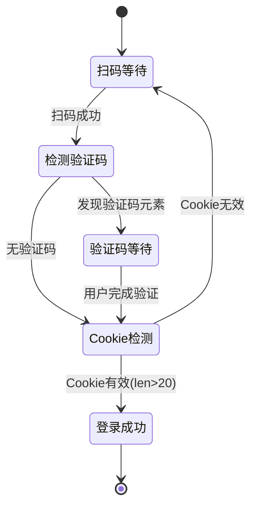

# 小红书验证码处理说明

## 问题背景

小红书最近增加了新的安全验证流程。现在的登录流程：

1. 显示QR二维码
2. 用户用小红书APP扫码
3. **【新增】小红书要求完成验证码验证**（图形验证码或滑块验证）
4. 验证通过后才设置登录Cookie

## 解决方案

### 技术方案

采用**检测+等待**策略：

1. **检测验证码页面**: 监控常见验证码元素
2. **提示用户**: 输出明确的日志提示
3. **继续等待**: 保持Cookie轮询，直到用户完成验证
4. **自动继续**: 验证完成后自动检测到登录Cookie

### 实现细节

#### 验证码检测逻辑

```go
// 检测常见的验证码元素
captchaSelectors := []string{
    ".verify-box",                    // 通用验证框
    ".captcha",                       // 验证码容器
    "[class*='verify']",              // 包含verify的class
    "[class*='captcha']",             // 包含captcha的class
    ".slider-verify",                 // 滑块验证
    "input[placeholder*='验证码']",   // 验证码输入框
}
```

#### 用户提示

检测到验证码时输出：
```
🔐 [WaitForLogin] 检测到验证码页面，请在浏览器中完成验证！
💡 [WaitForLogin] 提示：完成验证后系统会自动继续...
⏳ [WaitForLogin] 等待验证码完成... count=21
```

#### 状态机



## 用户使用流程

### 新的登录流程

1. **点击"获取登录二维码"**
   - 系统显示二维码

2. **扫描二维码**
   - 用小红书APP扫描

3. **完成验证码**（新增步骤）
   - 系统检测到验证码，输出提示：
     ```
     🔐 检测到验证码页面，请在浏览器中完成验证！
     💡 提示：完成验证后系统会自动继续...
     ```
   - **用户在Rod浏览器窗口中完成验证**（滑块/图形验证码）

4. **自动登录**
   - 验证完成后，系统自动检测到登录Cookie
   - 显示"✅ 登录成功！"

### 注意事项

⚠️ **关键点**：
- 验证码需要在**Rod浏览器窗口**中完成（不是小红书APP）
- 系统会一直等待（最长4分钟），不需要重新扫码
- 完成验证后会自动继续，不需要任何额外操作

## 技术细节

### 超时设置

```go
timeout := 4 * time.Minute  // 4分钟超时（足够完成验证码）
```

足够用户完成验证码操作。

### Cookie验证逻辑

```go
// 只有真正的登录Cookie才会被接受
if hasWebSession && hasA1 && len(webSessionValue) > 20 && len(a1Value) > 20 {
    // 登录成功
    return true
}
```

验证码完成前Cookie长度<20（tracking cookie）
验证码完成后Cookie长度>20（登录cookie）

### 不需要修改的部分

✅ 现有的Cookie轮询逻辑已经可以处理验证码等待
✅ 4分钟超时时间足够用户完成验证
✅ 不需要修改前端代码

只是增加了日志提示，让用户知道需要完成验证码。

## 常见问题

### Q: 为什么验证码要在浏览器窗口完成，而不是APP？

A: 扫码后，小红书会在**当前浏览器页面**弹出验证码，不是在APP中。Rod浏览器会显示这个验证码页面。

### Q: 如果用户不完成验证码会怎样？

A: 系统会一直等待4分钟，然后超时失败。Cookie始终是tracking cookie（短字符串），不会被误判为登录成功。

### Q: 验证码失败了怎么办？

A: 小红书会让用户重试验证码，系统继续等待。只有验证成功后才会设置登录Cookie。

### Q: 有些账号不需要验证码？

A: 是的。系统会检测验证码元素，如果没有验证码直接跳过这个检测。逻辑兼容两种情况。

### Q: 可以自动完成验证码吗？

A: 技术上可以集成第三方验证码识别服务，但：
- 增加系统复杂度
- 识别成功率不稳定
- 可能违反小红书服务条款
- 当前手动方案已经够用

**不推荐自动化验证码**。

## 后续优化可能

### 前端提示优化

可以在前端添加明确提示：
```typescript
// 当检测到验证码时，前端显示提示
if (response.data.needCaptcha) {
  toast.info("请在弹出的浏览器窗口中完成验证码验证")
}
```

但这需要修改MCP API返回格式，增加`needCaptcha`字段。

### 验证码元素监控

可以添加更多验证码选择器，适应小红书的UI变化：
```go
captchaSelectors := []string{
    // 现有选择器...
    ".smc-slider",          // SMC滑块验证
    "#nc_1_wrapper",        // 阿里云盾验证码
    // 更多...
}
```

根据实际遇到的验证码类型持续更新。

## 测试步骤

部署后测试流程：

1. **测试无验证码场景**
   - 退出登录
   - 获取二维码
   - 扫码
   - 如果没有验证码，应该直接登录成功

2. **测试有验证码场景**
   - 退出登录
   - 获取二维码
   - 扫码
   - 观察日志：
     - ✅ 应该看到"🔐 检测到验证码页面"
     - ✅ 应该看到"⏳ 等待验证码完成..."
   - 在Rod浏览器窗口完成验证码
   - 观察登录是否成功

3. **检查日志**
   ```bash
   # 应该看到的日志序列
   🔍 [WaitForLogin] 正在检查登录状态... count=1
   🔐 [WaitForLogin] 检测到验证码页面，请在浏览器中完成验证！
   💡 [WaitForLogin] 提示：完成验证后系统会自动继续...
   ⏳ [WaitForLogin] 等待验证码完成... count=11
   ⏳ [WaitForLogin] 等待验证码完成... count=21
   🎉 [WaitForLogin] 检测到有效登录Cookie！
   ✅ [WaitForLogin] 登录成功！
   ```

## 总结

验证码处理策略：
- ✅ **被动等待**：系统检测验证码并提示用户
- ✅ **用户操作**：用户在浏览器中手动完成
- ✅ **自动继续**：完成后系统自动检测登录
- ✅ **无侵入性**：不修改现有Cookie检测逻辑
- ✅ **向后兼容**：支持有/无验证码两种情况

这是最简单、最可靠的验证码处理方案。
