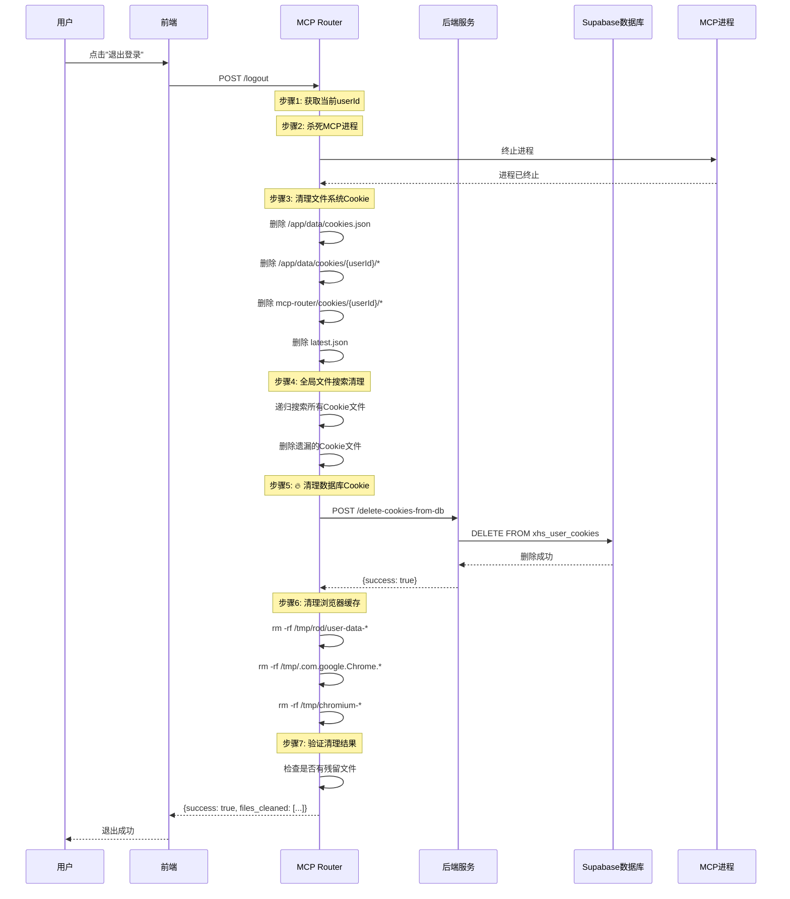
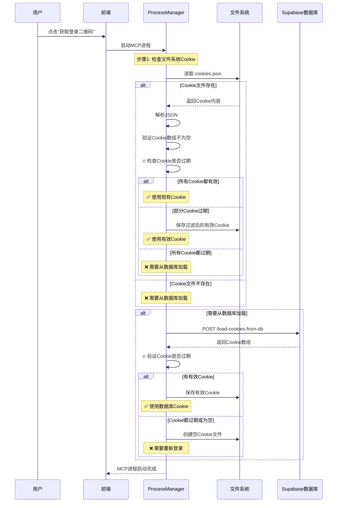

# Cookie清理问题修复方案

## 问题背景

### 核心问题
用户点击"退出登录"后，再点击"获取登录二维码"时，系统会自动登录，无需扫码。这违反了预期的登录流程。

### 根本原因
1. **不完整的Cookie清理**：logout操作只清理了文件系统中的Cookie，未清理数据库中的Cookie
2. **缺少Cookie验证**：processManager从数据库加载Cookie时，未验证Cookie是否有效（过期、空内容等）
3. **多层Cookie存储**：Cookie存储在多个位置（文件系统、数据库、浏览器缓存），需要全部清理

### Cookie存储位置
```
1. 文件系统:
   - /app/data/cookies.json
   - /app/data/cookies/{userId}/cookies.json
   - /app/playwright-service/mcp-router/cookies/{userId}/cookies.json
   - /app/playwright-service/mcp-router/latest.json

2. 数据库:
   - Supabase: xhs_user_cookies 表

3. 浏览器缓存:
   - Rod浏览器UserDataDir: /tmp/rod/user-data-*
   - Chromium临时目录: /tmp/.com.google.Chrome.*, /tmp/chromium-*

4. MCP进程内存:
   - Go进程内存中的Cookie缓存
```

## 修复方案

### Solution 1: 完整的Cookie清理

#### 文件修改
**`/Users/boliu/xiaohongshumcp-current/playwright-service/mcp-router/src/httpServer.ts`**

**修改内容**: 在logout端点中添加数据库Cookie删除

```typescript
// 5. 🔥 清理数据库中的Cookie（关键！防止从数据库重新加载旧Cookie）
try {
  console.log(`[Logout] 🗑️  开始清理数据库Cookie...`);
  const axios = await import('axios');

  // 🔥 调用后端服务删除数据库Cookie
  const backendUrl = process.env.CLAUDE_AGENT_URL
    || process.env.BACKEND_URL
    || 'https://xiaohongshu-automation-ai.zeabur.app';

  const deleteResponse = await axios.default.post(
    `${backendUrl}/agent/xiaohongshu/delete-cookies-from-db`,
    { userId },
    { timeout: 10000, headers: { 'Content-Type': 'application/json' } }
  );

  if (deleteResponse.data?.success) {
    console.log(`[Logout] ✅ 数据库Cookie删除成功`);
  } else {
    console.warn(`[Logout] ⚠️  数据库Cookie删除失败: ${deleteResponse.data?.error || 'Unknown error'}`);
  }
} catch (dbDeleteError) {
  console.warn(`[Logout] ⚠️  数据库Cookie删除失败:`, dbDeleteError instanceof Error ? dbDeleteError.message : String(dbDeleteError));
}
```

**修改位置**: 在步骤4（全局文件搜索清理）之后、步骤6（UserDataDir清理）之前

#### API端点添加
**`/Users/boliu/xiaohongshumcp-current/playwright-service/claude-agent-service/src/server.ts`**

**新增API**: `/agent/xiaohongshu/delete-cookies-from-db`

```typescript
// 从数据库删除Cookie
app.post('/agent/xiaohongshu/delete-cookies-from-db', async (req: Request, res: Response) => {
  try {
    const { userId } = req.body;

    if (!userId) {
      return res.status(400).json({
        success: false,
        error: 'userId is required',
      });
    }

    console.log(`[CookieDB API] 删除Cookie: userId=${userId}`);

    const { CookieDatabaseService } = await import('./cookieDatabaseService.js');
    const dbService = new CookieDatabaseService();
    await dbService.deleteCookies(userId);

    res.json({
      success: true,
      message: 'Cookies deleted from database successfully',
      userId: userId
    });
  } catch (error: any) {
    console.error('[CookieDB API] 删除失败:', error);
    res.status(500).json({
      success: false,
      error: error.message || 'Failed to delete cookies from database',
    });
  }
});
```

**修改位置**: 在 `/agent/xiaohongshu/load-cookies-from-db` 端点之后

### Solution 2: Cookie有效性验证

#### 文件修改
**`/Users/boliu/xiaohongshumcp-current/playwright-service/mcp-router/src/processManager.ts`**

**修改内容**: 改进Cookie加载逻辑，添加有效性验证

**关键改进**:
1. **验证文件系统Cookie**:
   - 检查文件是否存在
   - 解析JSON是否成功
   - 验证Cookie数组不为空
   - 检查Cookie是否过期（expiry字段）

2. **验证数据库Cookie**:
   - 加载后检查Cookie是否过期
   - 只保存有效的Cookie到文件系统

```typescript
// 🔥 关键改进：验证现有Cookie文件是否有效
let needLoadFromDb = false;

if (fs.existsSync(cookiesFile)) {
  try {
    const fileContent = fs.readFileSync(cookiesFile, 'utf8');
    const cookies = JSON.parse(fileContent);

    // 验证Cookie内容
    if (!Array.isArray(cookies) || cookies.length === 0) {
      console.log(`[ProcessManager] Cookie文件为空或无效，需要从数据库加载`);
      needLoadFromDb = true;
    } else {
      // 检查Cookie是否过期（如果有expiry字段）
      const now = Date.now() / 1000; // Unix timestamp in seconds
      const validCookies = cookies.filter((cookie: any) => {
        // 如果没有expiry字段，认为是有效的
        if (!cookie.expiry && !cookie.expires) return true;

        // 检查expiry字段（Unix timestamp）
        const expiry = cookie.expiry || cookie.expires;
        return expiry > now;
      });

      if (validCookies.length === 0) {
        console.log(`[ProcessManager] 所有Cookie都已过期，需要从数据库加载`);
        needLoadFromDb = true;
      } else if (validCookies.length < cookies.length) {
        console.log(`[ProcessManager] 部分Cookie已过期 (${cookies.length - validCookies.length}/${cookies.length})，但仍有有效Cookie`);
        // 保存过滤后的有效Cookie
        fs.writeFileSync(cookiesFile, JSON.stringify(validCookies, null, 2), 'utf8');
      } else {
        console.log(`[ProcessManager] Cookie文件有效: ${cookiesFile} (${validCookies.length} cookies)`);
      }
    }
  } catch (parseError) {
    console.warn(`[ProcessManager] Cookie文件解析失败，需要从数据库加载:`, parseError instanceof Error ? parseError.message : String(parseError));
    needLoadFromDb = true;
  }
} else {
  console.log(`[ProcessManager] Cookie文件不存在，需要从数据库加载`);
  needLoadFromDb = true;
}

// 从数据库加载Cookie（如果需要）
if (needLoadFromDb) {
  try {
    // ... 加载逻辑 ...

    if (response.data?.success && response.data?.cookies?.length > 0) {
      // 🔥 验证从数据库加载的Cookie是否有效
      const now = Date.now() / 1000;
      const validDbCookies = response.data.cookies.filter((cookie: any) => {
        if (!cookie.expiry && !cookie.expires) return true;
        const expiry = cookie.expiry || cookie.expires;
        return expiry > now;
      });

      if (validDbCookies.length > 0) {
        fs.writeFileSync(cookiesFile, JSON.stringify(validDbCookies, null, 2), 'utf8');
        console.log(`[ProcessManager] ✅ 从数据库加载了 ${validDbCookies.length} 个有效Cookie (总共 ${response.data.cookies.length} 个)`);
      } else {
        fs.writeFileSync(cookiesFile, '[]', 'utf8');
        console.log(`[ProcessManager] ⚠️  数据库中的Cookie都已过期，创建空文件`);
      }
    }
  } catch (dbError) {
    // ... 错误处理 ...
  }
}
```

## 完整的Logout流程

### 修复后的完整流程


## 新的Login流程

### 修复后的Cookie验证流程


## Cookie验证规则

### 文件系统Cookie验证
```typescript
// 验证条件
1. 文件存在: fs.existsSync(cookiesFile)
2. JSON有效: JSON.parse(fileContent)
3. 数组非空: Array.isArray(cookies) && cookies.length > 0
4. Cookie未过期: cookie.expiry > now (Unix timestamp)
```

### 数据库Cookie验证
```typescript
// 验证条件
1. API响应成功: response.data?.success
2. Cookie数组非空: response.data?.cookies?.length > 0
3. Cookie未过期: cookie.expiry > now (Unix timestamp)
```

### Cookie过期检查逻辑
```typescript
const now = Date.now() / 1000; // Unix timestamp in seconds
const validCookies = cookies.filter((cookie: any) => {
  // 如果没有expiry字段，认为是有效的（某些Cookie可能是session cookie）
  if (!cookie.expiry && !cookie.expires) return true;

  // 检查expiry或expires字段（Unix timestamp）
  const expiry = cookie.expiry || cookie.expires;
  return expiry > now;
});
```

## 测试清单

### Logout测试
- [ ] 点击"退出登录"
- [ ] 检查日志：`[Logout] 🗑️  开始清理数据库Cookie...`
- [ ] 检查日志：`[Logout] ✅ 数据库Cookie删除成功`
- [ ] 检查日志：`[Logout] ✅ 浏览器UserDataDir缓存清理完成`
- [ ] 验证文件系统：所有Cookie文件已删除
- [ ] 验证数据库：`xhs_user_cookies`表中用户记录已删除

### Login测试
- [ ] 点击"获取登录二维码"
- [ ] 检查日志：`[ProcessManager] Cookie文件不存在，需要从数据库加载`
- [ ] 检查日志：`[ProcessManager] 数据库中没有Cookie，创建空文件`
- [ ] 确认显示二维码（不会自动登录）
- [ ] 扫码登录
- [ ] 完成验证码（如果有）
- [ ] 确认登录成功

### Cookie过期测试
- [ ] 模拟过期Cookie（修改expiry字段）
- [ ] 启动MCP进程
- [ ] 检查日志：`[ProcessManager] 所有Cookie都已过期，需要从数据库加载`
- [ ] 确认创建空Cookie文件
- [ ] 确认需要重新登录

## 关键文件修改总结

### 1. `/playwright-service/mcp-router/src/httpServer.ts`
- **修改**: 添加数据库Cookie删除步骤
- **位置**: logout端点，步骤5
- **目的**: 确保数据库中的Cookie也被清理

### 2. `/playwright-service/claude-agent-service/src/server.ts`
- **修改**: 新增 `/agent/xiaohongshu/delete-cookies-from-db` API
- **位置**: Cookie数据库同步API区域
- **目的**: 提供数据库Cookie删除接口

### 3. `/playwright-service/mcp-router/src/processManager.ts`
- **修改**: 改进Cookie加载和验证逻辑
- **位置**: `startProcess`方法，Cookie加载部分
- **目的**: 防止加载无效或过期的Cookie

### 4. `/playwright-service/claude-agent-service/src/cookieDatabaseService.ts`
- **无需修改**: 已有 `deleteCookies` 方法
- **用途**: 被新API调用来删除数据库Cookie

## 预期效果

### 修复前
```
用户点击"退出登录"
→ 文件系统Cookie被删除
→ 数据库Cookie未删除
→ 点击"获取登录二维码"
→ ProcessManager从数据库加载旧Cookie
→ 自动登录（无需扫码）❌
```

### 修复后
```
用户点击"退出登录"
→ 文件系统Cookie被删除
→ 🔥 数据库Cookie被删除
→ 浏览器缓存被删除
→ 点击"获取登录二维码"
→ ProcessManager尝试加载Cookie
→ 🔥 文件系统无Cookie
→ 🔥 数据库无Cookie
→ 创建空Cookie文件
→ 显示二维码，等待扫码✅
```

## 日志示例

### 成功的Logout日志
```
[Logout] Starting logout for user user_xxx_prome
[Logout] 🔥 Killing MCP process for user user_xxx_prome
[Logout] ✅ Logout completed for user user_xxx_prome. Deleted 8 files/directories.
[Logout] 🗑️  开始清理数据库Cookie...
[CookieDB API] 删除Cookie: userId=user_xxx_prome
[CookieDB] 删除Cookie: userId=user_xxx_prome
[CookieDB] ✅ 删除成功
[Logout] ✅ 数据库Cookie删除成功
[Logout] 🧹 开始清理浏览器UserDataDir缓存...
[Logout] ✅ 执行清理命令: rm -rf /tmp/rod/user-data-* 2>/dev/null || true
[Logout] ✅ 浏览器UserDataDir缓存清理完成
```

### 成功的Login日志（需要重新登录）
```
[ProcessManager] Cookie文件不存在，需要从数据库加载
[ProcessManager] 尝试从数据库加载Cookie...
[ProcessManager] 使用后端服务: https://xiaohongshu-automation-ai.zeabur.app
[CookieDB API] 加载Cookie: userId=user_xxx_prome
[CookieDB] 加载Cookie: userId=user_xxx_prome
[CookieDB] 未找到Cookie记录
[ProcessManager] 数据库中没有Cookie，创建空文件
[ProcessManager] Starting MCP process for user user_xxx_prome on port 18060
```

### Cookie过期日志
```
[ProcessManager] Cookie文件已存在: /app/data/cookies/user_xxx_prome/cookies.json
[ProcessManager] 所有Cookie都已过期，需要从数据库加载
[ProcessManager] 尝试从数据库加载Cookie...
[ProcessManager] ⚠️  数据库中的Cookie都已过期，创建空文件
```

## 总结

这次修复从根本上解决了自动登录问题：

1. **完整清理**: Logout时删除所有存储位置的Cookie（文件系统 + 数据库 + 浏览器缓存）
2. **有效性验证**: 加载Cookie时验证是否过期、是否有效
3. **防止重用**: 即使有残留Cookie，也会因为验证失败而不被使用
4. **可追溯性**: 详细日志记录每个步骤，便于调试

通过这三层防护，确保logout后必须重新扫码登录。
