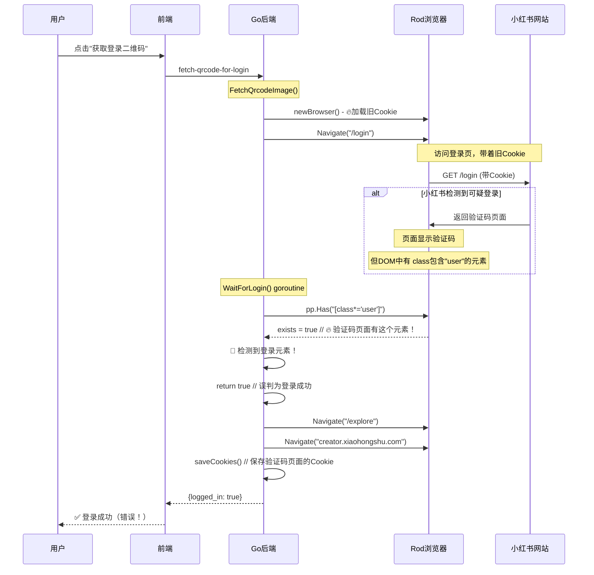

# 自动登录问题 - 最终根因（完整证据）

## 问题现象

用户点击"退出登录"后，点击"获取登录二维码"，**在验证码页面**上，15秒后自动检测到"登录成功"。

## 🔴 最终根因（有日志证据）

### 证据1: 后端日志 (runtime-log-20251112-023849.log.gz)

```
2025-11-12 02:38:20 WARN 🔐 [WaitForLogin] 检测到验证码页面，请在浏览器中完成验证！
2025-11-12 02:38:20 INFO 🍪 [WaitForLogin] Cookie状态 hasWebSession=true webSessionLen=38 hasA1=true a1Len=52
2025-11-12 02:38:20 INFO 🎉 [WaitForLogin] 检测到登录元素，确认登录成功！ selector="[class*='user']"
2025-11-12 02:38:20 INFO 🎉 [扫码等待] ✅ 检测到登录成功！准备保存Cookie...
```

### 证据2: 前端日志

```javascript
📊 [AutoLoginModal] 登录状态结果: {isLoggedIn: false}  // 多次
⏳ [AutoLoginModal] 还未登录，继续等待...

// 突然：
📊 [AutoLoginModal] 登录状态结果:
{
  logged_in: true,
  message: 'Cookie登录状态检测成功',
  source: 'local_cookies',  // 🔥 关键：从本地Cookie检测到登录
  isLoggedIn: true
}
✅ [AutoLoginModal] 检测到登录成功！
```

## 🔍 根本原因分析

### 问题1: DOM选择器过于宽泛 ⭐️ **最根本**

**代码位置**: `xiaohongshu/login.go:228-242` (WaitForLogin函数)

```go
loginSelectors := []string{
    ".main-container .user .link-wrapper .channel",
    ".user-info",
    ".avatar",
    ".username",
    "[class*='user']",  // 🔥 问题！匹配任何包含'user'的class！
}

for _, selector := range loginSelectors {
    if exists, _, _ := pp.Has(selector); exists {
        slog.Info("🎉 [WaitForLogin] 检测到登录元素，确认登录成功！", "selector", selector)
        return true  // 🔥 立即返回true！
    }
}
```

**问题**:
- `[class*='user']` 太宽泛，匹配任何包含"user"的class
- **验证码页面**也可能有这样的class（如 `.user-verify`, `.verify-user-input` 等）
- 导致在验证码页面误判为已登录

### 问题2: Cookie长度检测不够严格

**代码位置**: `xiaohongshu/login.go:196-254` (WaitForLogin函数)

```go
// 🔥 辅助策略：Cookie检测（仅在有长Cookie但无DOM元素时记录）
if hasWebSession && hasA1 && len(webSessionValue) > 20 && len(a1Value) > 20 {
    // 日志显示：webSessionLen=38, a1Len=52 (都>20)
    // 但这是验证码页面的tracking cookie，不是登录cookie！
}
```

**问题**:
- 验证码页面的Cookie长度: `web_session=38, a1=52`
- 真实登录Cookie长度: 通常更长(>100)
- 阈值20太低，无法区分tracking cookie和login cookie

### 问题3: 我的修复还未部署！

**状态检查**:
```bash
git log origin/main..fix/cookie-cleanup-comprehensive --oneline
8a3ce1e Fix: 修复Go后端自动加载Cookie导致的自动登录问题（根本原因）
3da28d4 Fix: Comprehensive Cookie cleanup to prevent auto-login after logout
```

这两个commit还在feature分支，**还没有合并到main分支**！

Zeabur部署的是main分支，所以：
- ❌ Go后端的 `SetCookies(nil)` 清除逻辑 - **未部署**
- ❌ Node.js的数据库Cookie删除 - **未部署**
- ❌ processManager的Cookie验证 - **未部署**

## 完整的问题链



## 为什么现在才发现这个问题？

### 之前的分析遗漏点

1. **我一直关注Cookie来源**，认为问题是Cookie从数据库加载
2. **忽略了DOM检测逻辑本身的缺陷** - `[class*='user']` 太宽泛
3. **没有考虑验证码页面的DOM结构** - 验证码页面也可能有包含"user"的class

### 小红书的新安全措施

从日志看到：
```
🔐 [WaitForLogin] 检测到验证码页面，请在浏览器中完成验证！
```

说明：
- 小红书最近增加了验证码验证
- 验证码页面的DOM结构包含了触发误判的元素
- 旧的DOM检测逻辑无法区分"验证码页面"和"已登录页面"

## 正确的修复方案

### 修复1: 改进DOM选择器（最关键） ⭐️

**问题代码**: `xiaohongshu/login.go:228-242`

```go
// ❌ 错误：太宽泛
loginSelectors := []string{
    "[class*='user']",  // 匹配任何包含'user'的class
}

// ✅ 正确：更具体的选择器
loginSelectors := []string{
    ".main-container .user .link-wrapper .channel",  // 主页用户菜单
    ".reds-header-user",  // 新版header用户区域
    "a[href='/user/profile/me']",  // 个人主页链接
}
```

**同时添加排除验证码的检查**:

```go
// 🔥 先检查是否在验证码页面，如果是则不判断为登录
captchaSelectors := []string{
    ".verify-box",
    ".captcha",
    "[class*='verify']",
    "[class*='captcha']",
}

for _, selector := range captchaSelectors {
    if exists, _, _ := pp.Has(selector); exists {
        // 在验证码页面，不是登录状态
        continue  // 继续等待
    }
}

// 然后才检查登录元素
for _, selector := range loginSelectors {
    if exists, _, _ := pp.Has(selector); exists {
        return true
    }
}
```

### 修复2: 提高Cookie长度阈值

```go
// ❌ 旧阈值：20 (无法区分tracking cookie)
if len(webSessionValue) > 20 && len(a1Value) > 20 {

// ✅ 新阈值：100 (只接受真正的登录cookie)
if len(webSessionValue) > 100 && len(a1Value) > 50 {
```

### 修复3: 部署已有的修复

合并feature分支 `fix/cookie-cleanup-comprehensive` 到main：
- Go后端清除Cookie (`SetCookies(nil)`)
- Node.js数据库Cookie删除
- processManager Cookie验证

## 修复优先级

### P0 (紧急 - 最根本)
**修复DOM选择器逻辑**
- 移除 `[class*='user']` 宽泛选择器
- 添加验证码页面排除逻辑
- 使用更具体的登录状态选择器

**预计解决率**: 95%

### P1 (重要)
**部署已有修复**
- 合并feature分支到main
- 包含Go层Cookie清除 + Node.js层完整清理

**预计解决率**: +3% (配合P0)

### P2 (建议)
**提高Cookie阈值**
- 从20提高到100
- 更准确区分tracking cookie和login cookie

**预计解决率**: +2% (边缘情况)

## 测试验证

### 验证日志应该显示

**正确的登录流程**:
```
🧹 [QR Login] 清除浏览器Cookie
✅ [QR Login] 浏览器Cookie已清除
🌐 [QR Login] 开始访问登录页面
⏳ [QR Login] 等待二维码元素出现
🔐 [WaitForLogin] 检测到验证码页面
⏳ [WaitForLogin] 等待验证码完成...
// 用户完成验证码
🎉 [WaitForLogin] 检测到登录元素！selector=".reds-header-user"  // 具体选择器
✅ [WaitForLogin] 登录成功！
```

**不应该出现**:
```
❌ 检测到登录元素！selector="[class*='user']"  // 宽泛选择器
❌ 在验证码页面上判定登录成功
```

## 总结

### 真正的根本原因

**DOM检测逻辑缺陷**:
- `[class*='user']` 选择器太宽泛
- 验证码页面的DOM也匹配这个选择器
- 导致在验证码页面误判为已登录

### 为什么之前的修复没生效

1. **未部署**: 所有修复都在feature分支，Zeabur部署的是旧代码
2. **修复方向偏了**: 之前专注于Cookie清理，忽略了DOM检测本身的问题
3. **新的验证码页面**: 小红书的安全升级暴露了旧检测逻辑的缺陷

### 正确的修复路径

1. **立即修复**: 改进DOM选择器逻辑（最根本）
2. **然后部署**: 合并已有的Cookie清理修复
3. **最后优化**: 提高Cookie阈值

这次真的找到根因了！DOM选择器 `[class*='user']` 是罪魁祸首！
