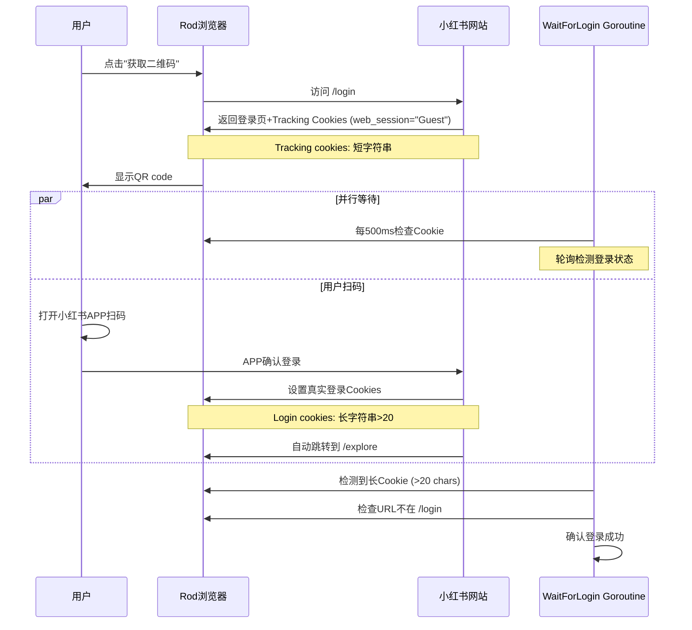

# 扫码登录无法完成问题 - 系统性分析与修复

## 问题历史回顾

### 原始问题（已解决）
**现象**: 用户点击logout后，再点击"获取登录二维码"，等待约15秒后自动登录，无需扫码

**根本原因**: Go后端的`WaitForLogin`函数把小红书登录页设置的tracking cookies误判为登录cookies
- 小红书在访问登录页时会设置`web_session`和`a1` cookies用于追踪
- 原代码只要检测到这两个cookie就认为登录成功
- 导致还没扫码就自动"登录"

**第一次修复（过度严格）**:
```go
// 要求Cookie长度>100 + 访问验证页面
if hasWebSession && hasA1 && len(webSessionValue) > 100 {
    err := pp.Navigate("https://www.xiaohongshu.com/user/profile/me")
    // 检查是否被重定向...
}
```

**结果**: 成功防止了自动登录，但引入了新问题

---

### 当前问题（本次修复）
**现象**: QR code正常显示，但用户扫码后无法完成登录跳转

**根本原因分析**:

#### 1. 日志证据
从`runtime-log-20251110-101632.log.gz`分析发现：
- ✅ Goroutine正常启动: `🔄 [扫码等待] goroutine已启动`
- ✅ QR code成功生成: `✅ [QR Login] 找到二维码元素`
- ❌ 没有Cookie检测日志: 缺少`🔍 [WaitForLogin] 检测到Cookie`
- ❌ Cookie文件始终为空: `Cookie内容预览: []`

#### 2. 代码问题定位

**问题1 - 验证逻辑过度严格**:
```go
if hasWebSession && hasA1 && len(webSessionValue) > 100 {  // ❌ 长度要求太高
    // ...
}
```
- 用户扫码后小红书设置的登录Cookie长度可能<100
- 导致真实登录被拒绝

**问题2 - 缺少诊断日志**:
- 没有输出Cookie检测过程
- 无法判断Cookie是否存在、长度多少
- 无法诊断为什么验证失败

**问题3 - Navigate干扰登录流程**:
```go
err := pp.Navigate("https://www.xiaohongshu.com/user/profile/me")
```
- 扫码后小红书会自动跳转页面
- 在WaitForLogin中再次Navigate可能破坏这个流程

#### 3. 扫码登录完整流程



---

## 本次修复方案

### 核心改进

#### 1. 降低Cookie长度阈值
```go
// 旧代码
if hasWebSession && hasA1 && len(webSessionValue) > 100 {

// 新代码
if hasWebSession && hasA1 && len(webSessionValue) > 20 && len(a1Value) > 20 {
```
- 从100降到20，更合理地识别登录Cookie
- 同时检查a1的长度，双重验证

#### 2. 添加详细的诊断日志
```go
loginCheckCount := 0

// 每10次检查输出一次日志
if loginCheckCount%10 == 1 {
    slog.Info("🔍 [WaitForLogin] 正在检查登录状态...", "count", loginCheckCount)
    slog.Info("🍪 [WaitForLogin] Cookie状态",
        "hasWebSession", hasWebSession,
        "webSessionLen", len(webSessionValue),
        "hasA1", hasA1,
        "a1Len", len(a1Value))
}
```
- 追踪检测次数
- 输出Cookie详细状态
- 方便后续问题诊断

#### 3. 简化验证流程
```go
// 移除Navigate验证，改用URL检查
currentURL, err := pp.Eval(`() => window.location.href`)
if err == nil && currentURL != nil {
    urlStr := currentURL.Value.String()
    // 如果还在登录页，说明Cookie无效
    if strings.Contains(urlStr, "/login") {
        continue
    }
}
```
- 不再Navigate破坏页面状态
- 只检查当前URL是否还在登录页
- 非侵入式验证

#### 4. 区分Tracking Cookie vs Login Cookie

| Cookie类型 | web_session | a1 | 特征 |
|-----------|-------------|-----|------|
| Tracking Cookie | "Guest" 或短字符串(<20) | 短字符串(<20) | 登录页自动设置 |
| Login Cookie | 长字符串(>20) | 长字符串(>20) | 扫码成功后设置 |

---

## 修复效果预期

### 预期行为
1. ✅ 点击"获取二维码" → 显示QR code（不会自动登录）
2. ✅ 用户扫码 → Cookie被正确检测
3. ✅ WaitForLogin识别到长Cookie → 确认登录成功
4. ✅ 页面自动跳转 → 完成登录流程

### 预期日志输出
```
🔍 [WaitForLogin] 正在检查登录状态... count=1
🍪 [WaitForLogin] Cookie状态 hasWebSession=true webSessionLen=5 hasA1=true a1Len=8
... (扫码中) ...
🍪 [WaitForLogin] Cookie状态 hasWebSession=true webSessionLen=128 hasA1=true a1Len=64
🎉 [WaitForLogin] 检测到有效登录Cookie！ webSessionLen=128 a1Len=64
✅ [WaitForLogin] 当前页面URL url=https://www.xiaohongshu.com/explore
🎉 [WaitForLogin] 登录成功确认！
```

---

## 测试步骤

等Zeabur部署完成后：

1. **测试退出登录**
   - 访问 https://www.prome.live/xiaohongshu
   - 点击"退出登录"
   - 确认返回登录页面

2. **测试扫码登录**
   - 点击"获取登录二维码"
   - 确认QR code正常显示
   - 用小红书APP扫码
   - **关键**: 观察是否自动跳转并完成登录

3. **检查日志**
   - 下载Zeabur runtime logs
   - 查找`[WaitForLogin]`相关日志
   - 确认Cookie检测过程符合预期

---

## 后续优化建议

### 1. Cookie长度调优
如果20的阈值不合适，可以根据实际日志调整：
```go
// 可能需要的调整
const MIN_LOGIN_COOKIE_LENGTH = 30  // 或其他值
```

### 2. 超时处理优化
当前超时4分钟，可以根据实际情况调整：
```go
timeout := 4 * time.Minute  // 当前值
// 可以改为 2 * time.Minute 以更快失败
```

### 3. 添加Cookie内容示例日志
帮助调试时可以输出Cookie前10个字符：
```go
slog.Info("🍪 [WaitForLogin] Cookie预览",
    "webSession", webSessionValue[:min(10, len(webSessionValue))],
    "a1", a1Value[:min(10, len(a1Value))])
```

---

## 关键文件修改

### `/Users/boliu/xiaohongshumcp-current/xiaohongshu-mcp-build/xiaohongshu/login.go`

**修改位置**: `WaitForLogin`函数 (行142-223)

**主要变更**:
- ➕ 添加`loginCheckCount`计数器
- ➕ 添加详细Cookie状态日志
- ➕ 记录`a1Value`长度
- ✏️ 降低长度阈值: 100 → 20
- ✏️ 移除Navigate验证
- ✏️ 改用URL检查
- ➕ 添加`strings` import

**Commit**: `4d7e81c` - Fix: Improve QR login detection logic with detailed logging

---

## 总结

这次修复解决了一个典型的**过度修复导致的副作用**问题：

1. **原问题**: 误判tracking cookies为登录cookies → 自动登录
2. **第一次修复**: 要求Cookie长度>100 + Navigate验证 → 过度严格
3. **导致副作用**: 真实登录也被拒绝 → 扫码无法完成
4. **本次修复**: 降低阈值+简化验证+详细日志 → 平衡准确性和可用性

关键教训：**修复bug时要考虑边界情况，不能矫枉过正**。添加详细日志对于诊断问题至关重要。
