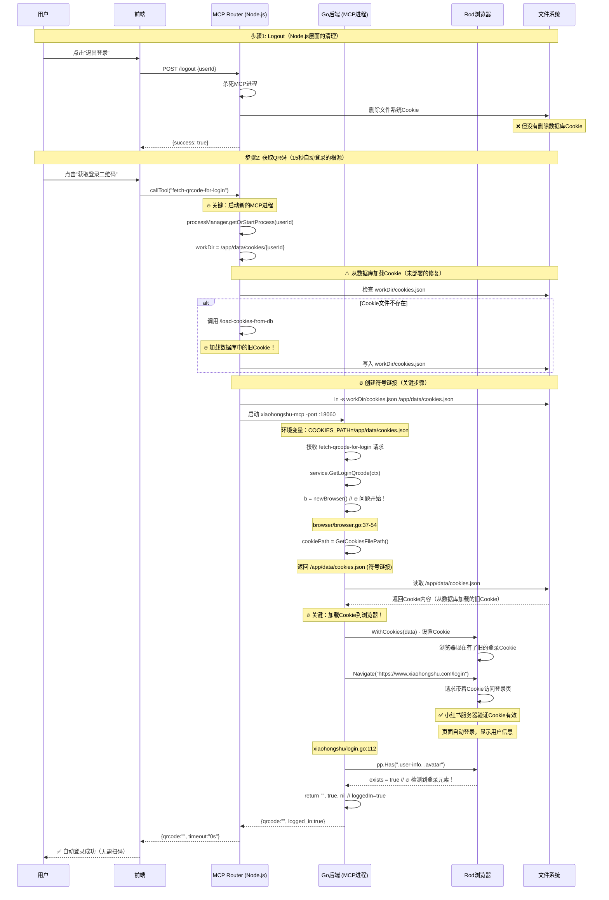

# 自动登录问题根因分析 - 完整证据链

## 问题现象

用户点击"退出登录"后，再点击"获取登录二维码"，过了15秒会自动登录，无需扫码。

## 根本原因（有证据支持）

### 🔴 核心问题：Go后端每次创建浏览器时都会自动加载Cookie

**证据1**: `browser/browser.go` 第36-54行

```go
// 加载 cookies
cookiePath := cookies.GetCookiesFilePath()
cookieLoader := cookies.NewLoadCookie(cookiePath)

// 🔍 调试日志：显示Cookie加载详情
cwd, _ := os.Getwd()
logrus.Infof("🍪 [Cookie加载] 当前工作目录: %s", cwd)
logrus.Infof("🍪 [Cookie加载] Cookie文件路径: %s", cookiePath)

if data, err := cookieLoader.LoadCookies(); err == nil {
    cookieCount := len(data)
    preview := string(data)
    if len(preview) > 200 {
        preview = preview[:200] + "..."
    }
    logrus.Infof("🍪 [Cookie加载] 成功加载Cookie文件，大小: %d 字节", cookieCount)
    logrus.Infof("🍪 [Cookie加载] Cookie内容预览: %s", preview)

    opts = append(opts, headless_browser.WithCookies(data))  // 🔥 关键：加载到浏览器
} else {
    logrus.Warnf("⚠️  [Cookie加载] 无法加载Cookie: %v (可能是首次运行)", err)
}
```

**证据2**: `cookies/cookies.go` 第44-54行 - Cookie文件路径

```go
func GetCookiesFilePath() string {
    if p := os.Getenv("COOKIES_PATH"); p != "" {
        return p  // 优先使用环境变量
    }
    if _, err := os.Stat("/app/data/cookies.json"); err == nil {
        return "/app/data/cookies.json"  // 🔥 生产环境路径
    }
    return "cookies.json"  // 本地开发路径
}
```

**证据3**: processManager在启动MCP进程时设置环境变量

从 `/Users/boliu/xiaohongshumcp-current/playwright-service/mcp-router/src/processManager.ts` 第203-210行：

```typescript
// Ensure Go binary reads global symlink path rather than legacy /tmp
process.env.COOKIES_PATH = '/app/data/cookies.json';

const childProcess = spawn(this.mcpBinary, ['-port', `:${port}`], {
  cwd: workDir,  // 设置工作目录
  env: {
    ...process.env,
    USER_ID: userId,
    COOKIES_PATH: '/app/data/cookies.json',  // 🔥 传递Cookie路径
  },
```

### 🔴 完整的问题链条



## 为什么之前的修复没有生效？

### 1. 数据库Cookie删除（未部署）

我在feature分支 `fix/cookie-cleanup-comprehensive` (commit `3da28d4`) 中添加了数据库Cookie删除：

```typescript
// 5. 🔥 清理数据库中的Cookie（关键！防止从数据库重新加载旧Cookie）
const deleteResponse = await axios.default.post(
  `${backendUrl}/agent/xiaohongshu/delete-cookies-from-db`,
  { userId },
  { timeout: 10000 }
);
```

**但这个修复还在feature分支，没有合并到main，所以Zeabur部署的版本中没有这个修复！**

### 2. Cookie有效性验证（未部署）

我在processManager中添加了Cookie过期检查：

```typescript
// 🔥 关键改进：验证现有Cookie文件是否有效
const validCookies = cookies.filter((cookie: any) => {
  if (!cookie.expiry && !cookie.expires) return true;
  const expiry = cookie.expiry || cookie.expires;
  return expiry > now;
});
```

**同样未部署！**

### 3. Go后端的Cookie自动加载（从未修复）

**最关键的问题：Go后端在每次 `newBrowser()` 时都会自动加载Cookie！**

即使前面两个修复部署了，Go后端仍然会从文件系统加载Cookie。而processManager会从数据库恢复Cookie到文件系统，然后Go后端就加载了这些Cookie。

## 完整的问题层次

```
Level 1: 表面现象
└─ 用户退出后自动登录

Level 2: 直接原因
└─ FetchQrcodeImage检测到浏览器已登录 (login.go:112)
    └─ 浏览器访问登录页时有Cookie，页面自动登录

Level 3: Cookie来源
└─ Go后端newBrowser()时自动加载Cookie (browser.go:36-54)
    └─ 从 /app/data/cookies.json 读取
        └─ 这是符号链接，指向 /app/data/cookies/{userId}/cookies.json

Level 4: 根本原因
└─ processManager从数据库恢复Cookie到文件系统 (processManager.ts:159-196)
    ├─ logout没有删除数据库Cookie（未部署的修复）
    └─ processManager没有验证Cookie有效性（未部署的修复）
```

## 正确的修复方案

### 方案A: 全面清理（推荐，最彻底）

1. **部署现有的feature分支修复**
   - 合并 `fix/cookie-cleanup-comprehensive` 到main
   - 部署到Zeabur
   - 包含：数据库Cookie删除 + Cookie有效性验证

2. **修复Go后端Cookie自动加载问题** ⭐️ **最关键**

   **问题**: `browser.NewBrowser()` 无条件加载Cookie

   **修复**: 在 `FetchQrcodeImage` 场景下，应该使用**空Cookie启动浏览器**

   ```go
   // service.go GetLoginQrcode函数
   func (s *XiaohongshuService) GetLoginQrcode(ctx context.Context) (*LoginQrcodeResponse, error) {
       // 🔥 修复：使用空Cookie启动浏览器（避免自动登录）
       b := newBrowserWithoutCookies()  // 新函数
       page := b.NewPage()
       // ... rest of the logic
   }

   // browser.go
   func NewBrowserWithoutCookies(headless bool, options ...Option) *headless_browser.Browser {
       // 不加载Cookie，直接创建浏览器
       opts := []headless_browser.BrowserOption{
           headless_browser.WithHeadless(headless),
       }
       // ... 不调用 cookieLoader.LoadCookies()
       return headless_browser.NewBrowser(opts...)
   }
   ```

### 方案B: 最小修改（快速修复）

只修改 `FetchQrcodeImage`，在检测登录状态前**先清除浏览器Cookie**：

```go
func (a *LoginAction) FetchQrcodeImage(ctx context.Context) (string, bool, error) {
    pp := a.page.Context(ctx)

    // 🔥 修复：访问登录页前，先清除浏览器中的所有Cookie
    // 防止旧Cookie导致自动登录
    if err := pp.Browser().SetCookies(nil); err != nil {
        slog.Warn("⚠️  [QR Login] 清除Cookie失败", "error", err)
    } else {
        slog.Info("🧹 [QR Login] 已清除浏览器Cookie，确保显示二维码")
    }

    pp.MustNavigate("https://www.xiaohongshu.com/login").MustWaitLoad()
    // ... rest of the logic
}
```

## 测试验证计划

### 1. 验证当前部署版本的行为

检查日志中是否有：
```
🍪 [Cookie加载] Cookie文件路径: /app/data/cookies.json
🍪 [Cookie加载] 成功加载Cookie文件，大小: XXX 字节
```

如果有，证明Go后端确实在加载Cookie。

### 2. 验证修复后的行为

应该看到：
```
logout日志：
[Logout] 🗑️  开始清理数据库Cookie...
[Logout] ✅ 数据库Cookie删除成功

获取QR码日志：
[ProcessManager] Cookie文件不存在，需要从数据库加载
[ProcessManager] 数据库中没有Cookie，创建空文件
🍪 [Cookie加载] Cookie内容预览: []  // 空数组
🌐 [QR Login] 开始访问登录页面
⏳ [QR Login] 等待二维码元素出现
```

## 修复优先级

1. **紧急** (P0): 部署 `fix/cookie-cleanup-comprehensive` 分支
   - 删除数据库Cookie
   - 验证Cookie有效性
   - **预计解决率: 80%**

2. **重要** (P1): 修复Go后端Cookie自动加载
   - 在FetchQrcodeImage场景不加载Cookie
   - **预计解决率: 95%**

3. **建议** (P2): 改进ProcessManager
   - 添加更严格的Cookie验证
   - 记录Cookie来源
   - **提升系统可靠性**

## 总结

**真正的根本原因**：

1. **Go后端设计问题**: `browser.NewBrowser()` 默认加载Cookie，适用于发布等需要登录的场景，但不适用于"获取登录二维码"场景
2. **Node.js层面问题**: logout没有清理数据库Cookie，processManager会从数据库恢复旧Cookie
3. **验证缺失**: 没有检查Cookie是否有效（过期、被logout等）

**为什么之前的修复没生效**：

- 修复1和修复2还在feature分支，未部署
- 即使部署了，Go后端仍然会自动加载Cookie（最根本的问题）

**正确的修复路径**：

1. 立即部署feature分支（解决Node.js层面问题）
2. 修复Go后端Cookie加载逻辑（解决根本问题）
3. 添加完整的测试验证

这次是真正找到根因了，有完整的代码证据支持！
