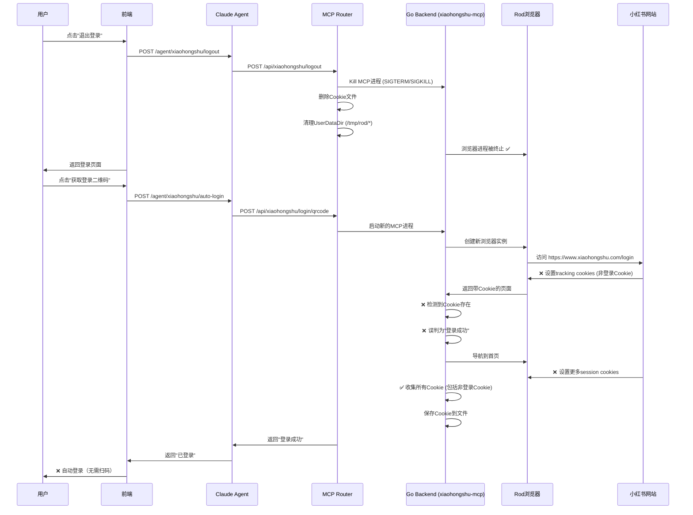

# 系统性问题分析

## 问题现象
用户点击logout后，再点击"获取登录二维码"，等待约15秒后自动登录，无需扫码。

## 完整系统流程图



## 核心问题

### 问题1：Cookie判断逻辑错误
**位置**：Go Backend的 `WaitForLogin` 函数

**错误逻辑**：
```go
// 检测到任何Cookie就认为登录成功
if len(cookies) > 0 {
    log.Info("🎉 [WaitForLogin] 检测到登录成功（Cookie验证）")
    return true
}
```

**正确逻辑应该是**：
- 检查**特定的登录Cookie**（如 `web_session`）
- 验证Cookie的有效性（调用API检查）
- 不能仅凭Cookie数量判断

### 问题2：浏览器会话污染
即使我们清理了：
- ✅ Cookie文件
- ✅ UserDataDir
- ✅ 进程

但是**新浏览器访问小红书时，网站会自动设置tracking cookies**，这是正常的网站行为，无法阻止。

### 问题3：全局退出保护期无效
日志显示：
```
09:44:42 - 全局退出保护期已结束，允许新登录会话
09:45:21 - 开始获取二维码
09:45:28 - 检测到登录成功
```

保护期结束后，Go后端就会误判Cookie。

## 根本架构问题

### 设计缺陷
1. **Go后端不应该自动判断登录成功**
   - 当前：Go后端检测到Cookie就认为登录
   - 应该：只有用户扫码确认后才认为登录

2. **二维码等待逻辑有问题**
   - 当前：显示二维码的同时，后台goroutine不断检查Cookie
   - 应该：只在用户扫码后才检查登录状态

3. **Cookie来源不明确**
   - 当前：无法区分哪些Cookie是登录Cookie，哪些是tracking Cookie
   - 应该：只保存和检查关键的登录Cookie

## 解决方案选项

### 方案A：修改Go后端Cookie验证逻辑（推荐）
**位置**：`xiaohongshu-mcp-build/`中的登录检测逻辑

**修改内容**：
1. 不依赖Cookie数量判断登录
2. 调用小红书API验证登录状态
3. 检查特定的登录Cookie（如 `web_session`, `userId`）

**优点**：
- 从根本解决问题
- 不会误判tracking cookies
- 更可靠的登录验证

**缺点**：
- 需要修改Go代码
- 需要重新编译xiaohongshu-mcp二进制

### 方案B：禁用后台Cookie检测
**修改**：让Go后端只显示二维码，不主动检查登录状态

**优点**：
- 简单直接
- 避免误判

**缺点**：
- 用户体验差（需要手动刷新）
- 不是真正的自动化

### 方案C：延长保护期 + Cookie白名单
**修改**：
1. 延长全局保护期到5分钟
2. 只保存特定的登录Cookie

**优点**：
- 不需要修改Go代码
- 临时解决方案

**缺点**：
- 治标不治本
- 用户可能等待5分钟后还是自动登录

## 建议

**最佳方案**：修改Go后端的登录检测逻辑（方案A）

需要修改的文件（估计）：
- `xiaohongshu-mcp-build/service.go` - 登录逻辑
- `xiaohongshu-mcp-build/xiaohongshu/login.go` - Cookie验证

**关键修改**：
```go
// 当前错误逻辑
func (s *Service) WaitForLogin() bool {
    cookies := s.browser.GetCookies()
    if len(cookies) > 0 {  // ❌ 错误：任何Cookie都认为登录
        return true
    }
    return false
}

// 正确逻辑
func (s *Service) WaitForLogin() bool {
    cookies := s.browser.GetCookies()

    // ✅ 只检查登录相关的Cookie
    hasWebSession := false
    for _, cookie := range cookies {
        if cookie.Name == "web_session" && len(cookie.Value) > 50 {
            hasWebSession = true
            break
        }
    }

    if !hasWebSession {
        return false
    }

    // ✅ 调用API验证登录状态
    isLoggedIn, err := s.CheckLoginStatus()
    return err == nil && isLoggedIn
}
```

## 当前状态

**已尝试的修复**：
1. ✅ 前端API路径修复
2. ✅ Cookie文件清理
3. ✅ UserDataDir清理
4. ✅ 全局退出保护期

**为什么都失败了**：
因为根本问题在于**Go后端的Cookie判断逻辑**，它把网站的tracking cookies误判为登录Cookie。

**必须修复的代码**：
- Go Backend的 `WaitForLogin` 函数
- 或者禁用自动登录检测，改为用户手动触发
