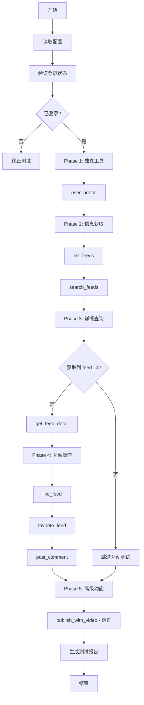

# Claude Code Agent MCP 工具测试指南

## 快速开始

### 1. 配置测试参数

编辑 `claudedocs/agent-test-config.json`:

```bash
cd /Users/boliu/xiaohongshumcp-current
nano claudedocs/agent-test-config.json
```

**必须修改的字段**:
```json
{
  "user_id": "YOUR_USER_ID_HERE"  // 👈 填写你的实际 user_id
}
```

**可选修改的字段**:
```json
{
  "test_data": {
    "search_keyword": "美食",        // 搜索关键词
    "comment_text": "很棒的分享！"   // 评论内容
  },
  "test_settings": {
    "delay_between_tests_ms": 3000  // 测试间隔 (毫秒)
  }
}
```

### 2. 确保已登录

访问生产环境并完成登录:
```
https://xiaohongshu-automation-ai.zeabur.app
```

扫码登录后，Cookie 会自动保存。

### 3. 运行测试

```bash
cd /Users/boliu/xiaohongshumcp-current
node claudedocs/run-mcp-test.js
```

### 4. 查看测试报告

测试完成后会生成报告文件:
```bash
# 查看最新的测试报告
ls -lt claudedocs/agent-test-report-*.md | head -1

# 打开报告
cat claudedocs/agent-test-report-2024-11-05T*.md
```

## 测试内容

### 测试的 8 个工具

1. ✅ **user_profile** - 获取用户信息
2. ✅ **list_feeds** - 获取首页动态
3. ✅ **search_feeds** - 搜索内容
4. ✅ **get_feed_detail** - 获取内容详情
5. ✅ **like_feed** - 点赞内容
6. ✅ **favorite_feed** - 收藏内容
7. ✅ **post_comment_to_feed** - 发表评论
8. ⏭️ **publish_with_video** - 视频发布 (暂时跳过)

### 排除的工具 (已测试过)

- `check_login_status` - 登录状态检查
- `get_login_qrcode` - 获取登录二维码
- `publish_content` - 图文发布

## 测试流程



## 预期输出

### 正常情况

```
🚀 Claude Code Agent 自动化测试开始
📝 配置信息:
  - 环境: production
  - Backend: https://xiaohongshu-automation-ai.zeabur.app
  - User ID: user_xxxxx
  - 超时时间: 30s
  - 重试次数: 3
  - 测试间隔: 3000ms

📋 Phase 0: 验证登录状态

🧪 开始测试: check_login_status
  📤 请求: check_login_status {}
  📥 响应: {"success":true,"data":{"logged_in":true}}
  ✅ 测试通过 (耗时: 1.2s)
  ✅ 登录状态正常，继续测试...

📋 Phase 1: 测试独立工具

🧪 开始测试: user_profile
  📤 请求: user_profile {}
  📥 响应: {"success":true,"data":{"nickname":"测试用户",...}}
  ✅ 测试通过 (耗时: 1.5s)

...

============================================================
📊 测试摘要
============================================================
✅ 成功: 7/8
❌ 失败: 0/8
⏭️  跳过: 1/8
⏱️  总耗时: 45.3s

🎉 所有测试通过！
============================================================
```

### 失败情况

```
🧪 开始测试: search_feeds
  📤 请求: search_feeds {"keyword":"美食","sort":"general"}
  ⚠️  测试失败，2秒后重试 (1/3)
  📤 请求: search_feeds {"keyword":"美食","sort":"general"}
  ❌ 测试失败 (耗时: 8.5s)
  📛 错误信息: Request timeout after 30s

...

⚠️  存在失败的测试，详情请查看报告文件
```

## 测试报告示例

生成的 Markdown 报告包含:

```markdown
# MCP 工具自动化测试报告

**测试时间**: 2024-11-05T10:30:00.000Z
**测试环境**: production (https://xiaohongshu-automation-ai.zeabur.app)
**用户ID**: user_xxxxx
**总耗时**: 45.3s

## 测试摘要

- ✅ 成功: 7/8
- ❌ 失败: 0/8
- ⏭️  跳过: 1/8

## 详细结果

### Phase 1: 独立工具

#### ✅ user_profile
- **状态**: 通过
- **耗时**: 1.5s
- **返回数据**:
```json
{
  "nickname": "测试用户",
  "avatar_url": "https://...",
  "user_id": "xxxxx"
}
```

...

## 问题汇总

1. **search_feeds** (NETWORK_ERROR): Request timeout after 30s

## 建议

- 🌐 **网络问题**: 增加超时时间或检查网络连接
```

## 常见问题

### Q1: 提示 "用户未登录或 Cookie 已过期"

**解决方法**:
1. 访问 `https://xiaohongshu-automation-ai.zeabur.app`
2. 完成扫码登录
3. 重新运行测试脚本

### Q2: 提示 "无法获取 feed_id，跳过后续测试"

**可能原因**:
- 首页动态为空
- 搜索结果为空

**解决方法**:
1. 修改配置文件中的 `search_keyword`，使用更常见的关键词
2. 确保账号已关注一些用户

### Q3: 测试超时

**解决方法**:
修改配置文件中的超时时间:
```json
{
  "test_settings": {
    "timeout_seconds": 60  // 增加到 60 秒
  }
}
```

### Q4: 频繁遇到限流错误

**解决方法**:
增加测试间隔:
```json
{
  "test_settings": {
    "delay_between_tests_ms": 5000  // 增加到 5 秒
  }
}
```

## 高级用法

### 仅测试特定工具

编辑配置文件:
```json
{
  "tools_to_test": [
    "user_profile",
    "search_feeds"
  ]
}
```

### 禁用自动清理

某些互动操作 (点赞、评论) 测试后不自动清理:
```json
{
  "test_settings": {
    "enable_cleanup": false
  }
}
```

### 使用本地环境测试

修改配置文件:
```json
{
  "environment": "local",
  "backend_url": "http://localhost:3001"
}
```

## 自动化运营示例

### 示例 1: 定时内容监控

创建 `claudedocs/auto-engagement.js`:

```javascript
const { callMCPTool } = require('./run-mcp-test');
const config = require('./agent-test-config.json');

async function autoEngagement() {
  console.log('🤖 开始自动内容监控与互动...');

  // 1. 搜索目标关键词
  const searchResult = await callMCPTool(config, 'search_feeds', {
    keyword: '科技新闻',
    sort: 'hot'
  });

  if (!searchResult.success || !searchResult.data?.feeds) {
    console.error('❌ 搜索失败');
    return;
  }

  // 2. 筛选高质量内容 (点赞数 > 1000)
  const topFeeds = searchResult.data.feeds
    .filter(f => f.liked_count > 1000)
    .slice(0, 5);

  console.log(`找到 ${topFeeds.length} 条高质量内容`);

  // 3. 批量互动
  for (const feed of topFeeds) {
    console.log(`\n处理内容: ${feed.title || feed.id}`);

    // 点赞
    await callMCPTool(config, 'like_feed', { feed_id: feed.id });
    await delay(3000);

    // 评论
    await callMCPTool(config, 'post_comment_to_feed', {
      feed_id: feed.id,
      content: '很棒的分享！学到了👍'
    });
    await delay(5000);
  }

  console.log('\n✅ 自动互动完成');
}

// 定时执行 (每小时)
setInterval(autoEngagement, 60 * 60 * 1000);
autoEngagement(); // 立即执行一次
```

运行:
```bash
node claudedocs/auto-engagement.js
```

### 示例 2: 竞品分析

创建 `claudedocs/competitor-analysis.js`:

```javascript
const { callMCPTool } = require('./run-mcp-test');
const config = require('./agent-test-config.json');
const fs = require('fs');

async function competitorAnalysis(keyword) {
  console.log(`🔍 开始分析关键词: ${keyword}`);

  // 1. 搜索内容
  const searchResult = await callMCPTool(config, 'search_feeds', {
    keyword,
    sort: 'time'
  });

  if (!searchResult.success) {
    console.error('搜索失败');
    return;
  }

  const feeds = searchResult.data.feeds || [];
  console.log(`找到 ${feeds.length} 条内容`);

  // 2. 获取详细数据
  const details = [];
  for (const feed of feeds.slice(0, 20)) {
    const detail = await callMCPTool(config, 'get_feed_detail', {
      feed_id: feed.id
    });

    if (detail.success) {
      details.push(detail.data);
    }

    await delay(2000);
  }

  // 3. 数据分析
  const analysis = {
    totalFeeds: details.length,
    avgLikes: average(details.map(d => d.liked_count || 0)),
    avgComments: average(details.map(d => d.comment_count || 0)),
    avgCollects: average(details.map(d => d.collected_count || 0)),
    topTags: extractTopTags(details),
    postingTimes: details.map(d => new Date(d.time).getHours())
  };

  // 4. 生成报告
  const report = `
# 竞品分析报告 - ${keyword}

**分析时间**: ${new Date().toISOString()}
**内容数量**: ${analysis.totalFeeds}

## 互动数据

- 平均点赞数: ${analysis.avgLikes.toFixed(0)}
- 平均评论数: ${analysis.avgComments.toFixed(0)}
- 平均收藏数: ${analysis.avgCollects.toFixed(0)}

## 热门话题标签

${analysis.topTags.slice(0, 10).map((tag, i) => `${i+1}. ${tag.tag} (${tag.count} 次)`).join('\n')}

## 发布时间分布

${JSON.stringify(analysis.postingTimes, null, 2)}

## 建议

- 最佳发布时间: ${getMostFrequentHour(analysis.postingTimes)}:00
- 推荐使用标签: ${analysis.topTags.slice(0, 3).map(t => `#${t.tag}`).join(' ')}
`;

  const reportPath = `claudedocs/competitor-report-${keyword}-${Date.now()}.md`;
  fs.writeFileSync(reportPath, report, 'utf-8');

  console.log(`\n✅ 报告已生成: ${reportPath}`);
}

function average(arr) {
  return arr.reduce((a, b) => a + b, 0) / arr.length;
}

function extractTopTags(details) {
  const tagCounts = {};
  details.forEach(d => {
    (d.tag_list || []).forEach(tag => {
      tagCounts[tag.name] = (tagCounts[tag.name] || 0) + 1;
    });
  });

  return Object.entries(tagCounts)
    .map(([tag, count]) => ({ tag, count }))
    .sort((a, b) => b.count - a.count);
}

function getMostFrequentHour(hours) {
  const counts = {};
  hours.forEach(h => counts[h] = (counts[h] || 0) + 1);
  return Object.entries(counts).sort((a, b) => b[1] - a[1])[0][0];
}

const delay = (ms) => new Promise(resolve => setTimeout(resolve, ms));

// 运行分析
competitorAnalysis('AI工具');
```

运行:
```bash
node claudedocs/competitor-analysis.js
```

## 下一步

测试通过后，你可以:

1. **开发自动化运营脚本** - 基于测试脚本，创建定时任务
2. **集成到 CI/CD** - 将测试脚本加入持续集成流程
3. **监控告警** - 定期运行测试，发现异常时发送通知
4. **扩展测试场景** - 添加更复杂的测试流程和验证逻辑

## 相关文档

- [MCP 功能测试指南](../docs/MCP功能测试指南.md) - 详细的 API 文档
- [Claude Agent 自动化测试方案](./Claude-Agent-自动化测试方案.md) - 完整的方案设计

---

**由 Claude Code Agent 提供技术支持**
