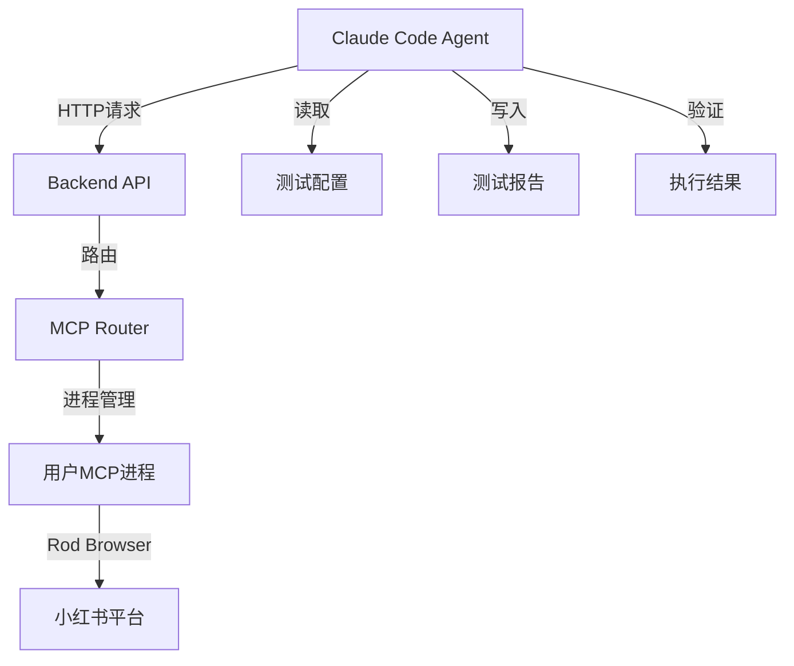
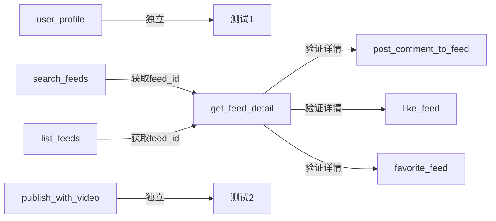
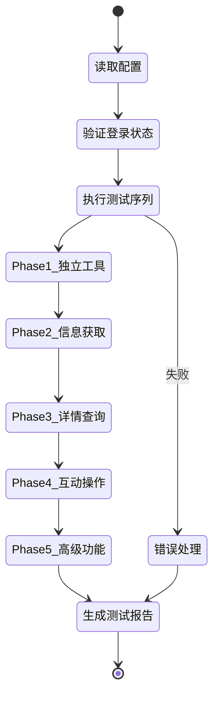
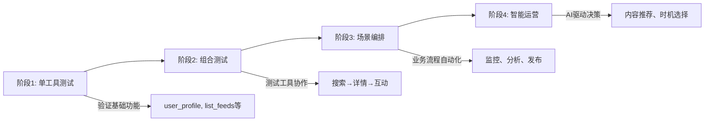

# Claude Code Agent 自动化测试与运营方案

## 概述

本文档定义了如何使用 Claude Code Agent 作为"AI大脑"来自动测试和运营小红书 MCP 工具集。

## 一、架构设计

### 1.1 系统组件



### 1.2 连接方式

Claude Code Agent 通过以下方式与系统交互：

**生产环境**:
- Backend API: `https://xiaohongshu-automation-ai.zeabur.app`
- 认证方式: Bearer Token (从环境变量获取)
- 用户ID: 从配置文件读取

**本地环境**:
- Backend API: `http://localhost:3001`
- 开发调试模式

### 1.3 Agent 能力需求

Claude Code Agent 需要具备：
1. HTTP 请求能力 (调用 Backend API)
2. 文件读写能力 (配置文件、测试报告)
3. 逻辑判断能力 (验证响应、决策下一步)
4. 状态管理能力 (跟踪测试进度)
5. 错误处理能力 (重试、回滚、报告)

## 二、待测试的 MCP 工具

### 2.1 工具清单

已测试工具 (排除):
- ✅ check_login_status
- ✅ get_login_qrcode
- ✅ publish_content

待测试工具 (共8个):
1. **publish_with_video** - 视频发布
2. **list_feeds** - 获取首页动态
3. **search_feeds** - 搜索内容
4. **get_feed_detail** - 获取内容详情
5. **post_comment_to_feed** - 发表评论
6. **like_feed** - 点赞内容
7. **favorite_feed** - 收藏内容
8. **user_profile** - 获取用户信息

### 2.2 工具依赖关系



**测试顺序建议**:
1. Phase 1: 独立工具 → `user_profile`
2. Phase 2: 信息获取 → `list_feeds` → `search_feeds`
3. Phase 3: 详情查询 → `get_feed_detail`
4. Phase 4: 互动操作 → `like_feed` → `favorite_feed` → `post_comment_to_feed`
5. Phase 5: 高级功能 → `publish_with_video`

## 三、测试执行方案

### 3.1 测试流程



### 3.2 配置文件格式

创建 `claudedocs/agent-test-config.json`:

```json
{
  "environment": "production",
  "backend_url": "https://xiaohongshu-automation-ai.zeabur.app",
  "user_id": "YOUR_USER_ID",
  "auth_token": "YOUR_AUTH_TOKEN",
  "test_settings": {
    "retry_count": 3,
    "timeout_seconds": 30,
    "delay_between_tests_ms": 2000
  },
  "test_data": {
    "search_keyword": "美食",
    "comment_text": "很棒的分享！👍",
    "video_path": "/path/to/test-video.mp4"
  }
}
```

### 3.3 测试脚本模板

每个工具的测试遵循统一模板：

```javascript
async function testTool(toolName, params) {
  console.log(`\n🧪 开始测试: ${toolName}`);

  try {
    // 1. 构造请求
    const response = await fetch(`${config.backend_url}/api/mcp/call-tool`, {
      method: 'POST',
      headers: {
        'Content-Type': 'application/json',
        'Authorization': `Bearer ${config.auth_token}`
      },
      body: JSON.stringify({
        user_id: config.user_id,
        tool_name: toolName,
        arguments: params
      })
    });

    // 2. 解析响应
    const result = await response.json();

    // 3. 验证结果
    if (!result.success) {
      throw new Error(result.error || '未知错误');
    }

    // 4. 提取数据
    const data = result.data;
    console.log(`✅ 测试通过: ${toolName}`);

    return { success: true, data };

  } catch (error) {
    console.error(`❌ 测试失败: ${toolName}`, error.message);
    return { success: false, error: error.message };
  }
}
```

### 3.4 完整测试序列

```javascript
async function runCompleteTest() {
  const results = {};

  // Phase 1: 独立工具
  console.log('\n📋 Phase 1: 测试独立工具');
  results.user_profile = await testTool('user_profile', {});
  await delay(2000);

  // Phase 2: 信息获取
  console.log('\n📋 Phase 2: 测试信息获取');
  results.list_feeds = await testTool('list_feeds', {});
  await delay(2000);

  results.search_feeds = await testTool('search_feeds', {
    keyword: config.test_data.search_keyword,
    sort: 'general'
  });
  await delay(2000);

  // Phase 3: 获取详情
  console.log('\n📋 Phase 3: 测试详情查询');

  // 从搜索结果中获取第一个 feed_id
  let feedId = null;
  if (results.search_feeds.success && results.search_feeds.data.feeds) {
    feedId = results.search_feeds.data.feeds[0]?.id;
  }

  if (!feedId && results.list_feeds.success && results.list_feeds.data.feeds) {
    feedId = results.list_feeds.data.feeds[0]?.id;
  }

  if (!feedId) {
    console.error('❌ 无法获取 feed_id，跳过后续测试');
    return results;
  }

  results.get_feed_detail = await testTool('get_feed_detail', {
    feed_id: feedId
  });
  await delay(2000);

  // Phase 4: 互动操作
  console.log('\n📋 Phase 4: 测试互动操作');

  results.like_feed = await testTool('like_feed', {
    feed_id: feedId
  });
  await delay(2000);

  results.favorite_feed = await testTool('favorite_feed', {
    feed_id: feedId
  });
  await delay(2000);

  results.post_comment = await testTool('post_comment_to_feed', {
    feed_id: feedId,
    content: config.test_data.comment_text
  });
  await delay(2000);

  // Phase 5: 高级功能 (暂时跳过，需要视频文件)
  console.log('\n📋 Phase 5: 高级功能 (需要准备视频文件)');
  console.log('⚠️  publish_with_video 需要手动测试');

  return results;
}
```

## 四、验证策略

### 4.1 成功标准

每个工具测试通过需满足：

1. **HTTP 响应成功**: `response.ok === true`
2. **业务逻辑成功**: `result.success === true`
3. **数据格式正确**: 返回数据符合预期结构
4. **功能实际生效**: 在小红书平台可见 (点赞、评论等)

### 4.2 验证检查点

| 工具 | 验证方式 |
|------|---------|
| user_profile | 返回用户名、头像等信息 |
| list_feeds | 返回 feeds 数组，长度 > 0 |
| search_feeds | 返回包含关键词的 feeds |
| get_feed_detail | 返回详细的笔记内容 |
| like_feed | 返回成功标识，可在平台确认 |
| favorite_feed | 返回成功标识，可在收藏夹确认 |
| post_comment_to_feed | 返回评论ID，可在笔记下看到评论 |
| publish_with_video | 返回发布成功，可在个人主页看到 |

### 4.3 错误分类

```javascript
function categorizeError(error) {
  if (error.includes('not logged in') || error.includes('Cookie')) {
    return 'AUTH_ERROR'; // 认证问题
  } else if (error.includes('timeout') || error.includes('网络')) {
    return 'NETWORK_ERROR'; // 网络问题
  } else if (error.includes('参数') || error.includes('invalid')) {
    return 'PARAM_ERROR'; // 参数问题
  } else if (error.includes('限流') || error.includes('rate limit')) {
    return 'RATE_LIMIT'; // 平台限流
  } else {
    return 'UNKNOWN_ERROR'; // 未知错误
  }
}
```

## 五、测试报告格式

### 5.1 报告结构

生成 `claudedocs/agent-test-report-[timestamp].md`:

```markdown
# MCP 工具自动化测试报告

**测试时间**: 2024-11-05 10:30:00
**测试环境**: Production (https://xiaohongshu-automation-ai.zeabur.app)
**用户ID**: user_xxxxx

## 测试摘要

- ✅ 成功: 6/8
- ❌ 失败: 2/8
- ⏭️ 跳过: 0/8

## 详细结果

### Phase 1: 独立工具

#### ✅ user_profile
- **状态**: 通过
- **耗时**: 1.2s
- **返回数据**:
  ```json
  {
    "nickname": "测试用户",
    "avatar_url": "https://...",
    "user_id": "xxxxx"
  }
  ```

### Phase 2: 信息获取

#### ✅ list_feeds
- **状态**: 通过
- **耗时**: 2.5s
- **返回数据**: 获取到 20 条动态

#### ❌ search_feeds
- **状态**: 失败
- **错误类型**: NETWORK_ERROR
- **错误信息**: Request timeout after 30s
- **建议**: 增加超时时间或检查网络

...

## 问题汇总

1. **search_feeds 超时**: 需要优化网络或增加超时时间
2. **post_comment 限流**: 小红书平台限制评论频率

## 建议

1. 对于高频操作，增加延迟间隔 (3-5秒)
2. 实现更智能的重试机制
3. 添加 Cookie 有效性检查
```

### 5.2 实时日志输出

测试过程中输出清晰的日志：

```
🚀 Claude Code Agent 自动化测试开始
📝 读取配置文件: claudedocs/agent-test-config.json
🔐 验证登录状态...
✅ 登录状态正常

📋 Phase 1: 测试独立工具
🧪 开始测试: user_profile
  ⏱️  耗时: 1.2s
  ✅ 测试通过
  📊 返回数据: {"nickname": "测试用户", ...}

📋 Phase 2: 测试信息获取
🧪 开始测试: list_feeds
  ⏱️  耗时: 2.5s
  ✅ 测试通过
  📊 获取到 20 条动态

...

📄 生成测试报告: claudedocs/agent-test-report-20241105-103000.md
✅ 所有测试完成！
```

## 六、错误处理与重试

### 6.1 重试策略

```javascript
async function retryWrapper(fn, maxRetries = 3) {
  for (let i = 0; i < maxRetries; i++) {
    try {
      return await fn();
    } catch (error) {
      const errorType = categorizeError(error.message);

      // 认证错误不重试
      if (errorType === 'AUTH_ERROR') {
        throw error;
      }

      // 参数错误不重试
      if (errorType === 'PARAM_ERROR') {
        throw error;
      }

      // 网络错误和限流错误重试
      if (i < maxRetries - 1) {
        const delay = Math.pow(2, i) * 1000; // 指数退避
        console.log(`⚠️  测试失败，${delay/1000}秒后重试 (${i+1}/${maxRetries})`);
        await sleep(delay);
      } else {
        throw error;
      }
    }
  }
}
```

### 6.2 回滚机制

对于产生副作用的操作 (点赞、评论、收藏)，测试后应清理：

```javascript
async function testWithCleanup(toolName, params, cleanupFn) {
  let result;
  try {
    result = await testTool(toolName, params);

    // 测试成功后执行清理
    if (result.success && cleanupFn) {
      console.log(`🧹 清理测试数据...`);
      await cleanupFn(result.data);
    }

    return result;
  } catch (error) {
    throw error;
  }
}

// 使用示例
results.like_feed = await testWithCleanup(
  'like_feed',
  { feed_id: feedId },
  async (data) => {
    // 取消点赞
    await testTool('like_feed', { feed_id: feedId }); // 再次调用取消
  }
);
```

## 七、自动化运营场景

### 7.1 运营任务编排

Claude Code Agent 可以作为"大脑"编排复杂的运营任务：

**场景1: 自动内容监控与互动**
```javascript
async function autoEngagement() {
  // 1. 搜索目标关键词
  const searchResult = await callMCPTool('search_feeds', {
    keyword: '科技新闻',
    sort: 'hot'
  });

  // 2. 筛选高质量内容
  const topFeeds = searchResult.data.feeds
    .filter(f => f.liked_count > 1000)
    .slice(0, 5);

  // 3. 批量互动
  for (const feed of topFeeds) {
    await callMCPTool('like_feed', { feed_id: feed.id });
    await delay(3000);

    await callMCPTool('post_comment_to_feed', {
      feed_id: feed.id,
      content: generateSmartComment(feed.title)
    });
    await delay(5000);
  }
}
```

**场景2: 竞品内容分析**
```javascript
async function competitorAnalysis(competitorKeyword) {
  // 1. 搜索竞品内容
  const feeds = await callMCPTool('search_feeds', {
    keyword: competitorKeyword,
    sort: 'time'
  });

  // 2. 获取详细数据
  const details = await Promise.all(
    feeds.data.feeds.map(f =>
      callMCPTool('get_feed_detail', { feed_id: f.id })
    )
  );

  // 3. 分析趋势
  const analysis = {
    avgLikes: calculateAverage(details, 'liked_count'),
    avgComments: calculateAverage(details, 'comment_count'),
    topTags: extractTopTags(details),
    postingPattern: analyzePostingTime(details)
  };

  // 4. 生成报告
  await writeAnalysisReport(analysis);
}
```

**场景3: 智能发布调度**
```javascript
async function smartPublishing() {
  // 1. 检查当前账号状态
  const profile = await callMCPTool('user_profile', {});

  // 2. 分析最佳发布时机
  const feeds = await callMCPTool('list_feeds', {});
  const bestTime = analyzeBestPostingTime(feeds.data);

  // 3. 等待最佳时机
  await waitUntil(bestTime);

  // 4. 发布内容
  const content = await generateContent();
  await callMCPTool('publish_content', content);

  // 5. 监控表现
  await monitorPerformance(content.id);
}
```

### 7.2 决策树

Claude Code Agent 可以实现智能决策：

```javascript
async function intelligentModeration(feedId) {
  // 1. 获取内容详情
  const detail = await callMCPTool('get_feed_detail', { feed_id: feedId });

  // 2. AI 分析内容质量
  const quality = await analyzeContentQuality(detail.data);

  // 3. 决策行动
  if (quality.score > 8) {
    // 高质量内容：收藏 + 点赞 + 评论
    await callMCPTool('favorite_feed', { feed_id: feedId });
    await callMCPTool('like_feed', { feed_id: feedId });
    await callMCPTool('post_comment_to_feed', {
      feed_id: feedId,
      content: generateEngagingComment(detail.data)
    });
  } else if (quality.score > 5) {
    // 中等质量：仅点赞
    await callMCPTool('like_feed', { feed_id: feedId });
  } else {
    // 低质量：跳过
    console.log('⏭️  内容质量不足，跳过');
  }
}
```

## 八、实施步骤

### Step 1: 准备配置文件
```bash
# 创建配置文件
cp claudedocs/agent-test-config.example.json claudedocs/agent-test-config.json

# 编辑配置
# - 填写正确的 user_id
# - 填写认证 token (如需要)
# - 调整测试参数
```

### Step 2: 确保登录状态
```bash
# 在生产环境扫码登录
# 访问: https://xiaohongshu-automation-ai.zeabur.app
# 完成登录流程
```

### Step 3: 执行测试
```bash
# Claude Code Agent 读取配置
# 按照测试序列执行
# 生成测试报告
```

### Step 4: 分析报告
```bash
# 查看生成的测试报告
cat claudedocs/agent-test-report-[timestamp].md

# 根据报告修复问题
# 重新执行失败的测试
```

## 九、安全与限制

### 9.1 速率限制

- **搜索操作**: 每分钟最多 10 次
- **互动操作** (点赞/评论): 每分钟最多 5 次
- **发布操作**: 每小时最多 2 次

在测试中使用适当的延迟 (2-5秒)。

### 9.2 Cookie 有效性

定期检查 Cookie 是否过期：

```javascript
async function ensureAuthenticated() {
  const status = await callMCPTool('check_login_status', {});
  if (!status.data.logged_in) {
    throw new Error('Cookie 已过期，需要重新登录');
  }
}
```

### 9.3 异常监控

记录所有异常情况：

```javascript
const errorLog = [];

function logError(toolName, error) {
  errorLog.push({
    timestamp: new Date().toISOString(),
    tool: toolName,
    error: error.message,
    type: categorizeError(error.message)
  });
}

// 测试结束后生成错误报告
function generateErrorReport() {
  const grouped = groupBy(errorLog, 'type');
  console.log('\n📊 错误统计:');
  for (const [type, errors] of Object.entries(grouped)) {
    console.log(`  ${type}: ${errors.length} 次`);
  }
}
```

## 十、总结

### 10.1 核心优势

1. **自动化程度高**: Claude Code Agent 可完全自动执行测试
2. **智能决策能力**: 基于测试结果动态调整策略
3. **完整可追溯**: 详细的日志和报告便于问题排查
4. **扩展性强**: 易于添加新的测试场景和运营任务

### 10.2 实施路径



### 10.3 下一步行动

1. **立即执行**: 使用 Claude Code Agent 运行完整测试序列
2. **分析结果**: 查看测试报告，修复发现的问题
3. **迭代优化**: 根据测试反馈调整参数和策略
4. **扩展场景**: 实现自动化运营任务编排
5. **持续监控**: 定期执行测试，确保系统稳定性

---

**准备就绪！** Claude Code Agent 现在可以作为"AI大脑"，自动测试和运营小红书 MCP 工具集。
