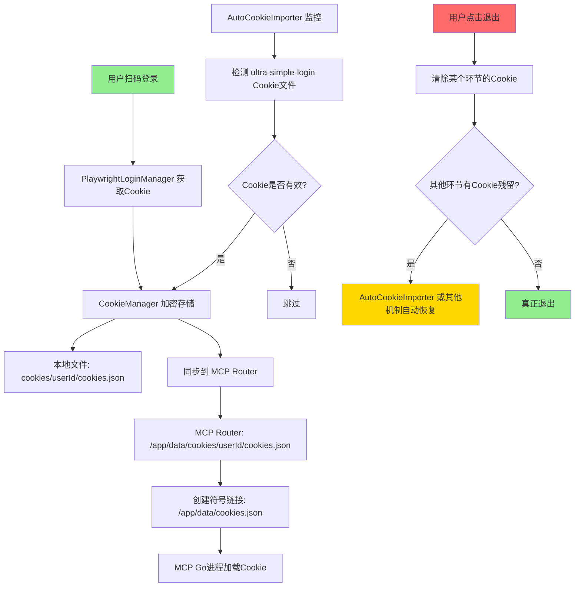

# Cookie 流转链条完整分析

## 🔍 问题现象

```
🍪 [Cookie加载] Cookie文件路径: /app/data/cookies.json
🍪 [Cookie加载] Cookie内容预览: []  ← 空的！
```

**用户退出登录后，Cookie 又被自动恢复，导致永远无法彻底退出。**

---

## 📊 Cookie 流转链条（完整）



---

## 🗂️ Cookie 存储位置（所有环节）

### 1. **CookieManager** (加密存储)
```typescript
// 文件: claude-agent-service/src/cookieManager.ts
private cookiesDir = path.join(process.cwd(), 'cookies');

// 存储路径:
// - 本地开发: ./cookies/{userId}/cookies.json
// - Zeabur: /app/playwright-service/claude-agent-service/cookies/{userId}/cookies.json
```

### 2. **MCP Router** (持久化卷)
```typescript
// 文件: mcp-router/src/processManager.ts
const COOKIE_DIR = process.env.COOKIE_DIR || '/app/data/cookies';

// 存储路径:
// - /app/data/cookies/{userId}/cookies.json
```

### 3. **符号链接** (MCP Go 进程读取)
```typescript
// 文件: mcp-router/src/processManager.ts
const mcpExpectedPath = '/app/data/cookies.json';

// 符号链接:
// /app/data/cookies.json -> /app/data/cookies/{userId}/cookies.json
```

### 4. **AutoCookieImporter** (自动导入源)
```typescript
// 文件: claude-agent-service/src/autoCookieImporter.ts
private readonly WATCH_PATHS = [
  '/tmp/xiaohongshu_cookies.json',
  '/app/mcp-router/cookies/latest.json',
  path.join('..', 'mcp-router', 'cookies', 'latest.json'),
  // ... 更多路径
];
```

### 5. **FloatingLoginService** (Playwright 会话)
```typescript
// 文件: claude-agent-service/src/floatingLoginService.ts
// 内存中的 Playwright 浏览器上下文
// 包含登录状态的会话
```

### 6. **CookieOrchestrator** (Cookie 编排器)
```typescript
// 文件: claude-agent-service/src/cookieOrchestrator.ts
// 协调多个来源的 Cookie，智能选择最佳Cookie
```

---

## ⚠️ 当前清理逻辑的问题

### 问题 1: **只清理了单点**
```typescript
// 现有的 logout API 只清理了:
1. MCP Router 的进程 ✅
2. 通知 AutoCookieImporter 阻止导入 ✅
3. 通知 GlobalLogoutState 阻止保存 ✅

// 但没有清理:
❌ CookieManager 的加密存储
❌ MCP Router 的持久化文件
❌ AutoCookieImporter 的监控源文件
❌ FloatingLoginService 的浏览器会话
❌ CookieOrchestrator 的缓存
```

### 问题 2: **自动恢复机制**
```typescript
// AutoCookieImporter 每 10 秒检查一次
startAutoImport(intervalMs: number = 10000)

// 如果监控路径中有有效的Cookie文件，会自动导入
// 即使用户刚退出登录！
```

### 问题 3: **符号链接残留**
```typescript
// 符号链接指向旧的Cookie文件
/app/data/cookies.json -> /app/data/cookies/user_xxx/cookies.json

// 即使清空了源文件，符号链接依然存在
// MCP Go 进程重启时会再次读取
```

---

## ✅ 完整的清理方案

### 第一步：停止所有自动机制
```typescript
// 1. 阻止 AutoCookieImporter
autoCookieImporter.notifyUserLogout(userId);

// 2. 阻止 GlobalLogoutState
globalLogoutState.notifyUserLogout(userId);

// 3. 停止 CookieOrchestrator 的自动同步
cookieOrchestrator.pauseAutoSync(userId);
```

### 第二步：清理所有 Cookie 文件
```typescript
const cookiePaths = [
  // CookieManager 加密存储
  path.join(process.cwd(), 'cookies', userId, 'cookies.json'),
  path.join('/app/playwright-service/claude-agent-service/cookies', userId, 'cookies.json'),

  // MCP Router 持久化存储
  path.join('/app/data/cookies', userId, 'cookies.json'),
  path.join(COOKIE_DIR, userId, 'cookies.json'),

  // AutoCookieImporter 监控源
  '/tmp/xiaohongshu_cookies.json',
  '/app/mcp-router/cookies/latest.json',
  path.join('..', 'mcp-router', 'cookies', 'latest.json'),

  // 符号链接
  '/app/data/cookies.json'
];

for (const p of cookiePaths) {
  if (fs.existsSync(p)) {
    if (fs.lstatSync(p).isSymbolicLink()) {
      fs.unlinkSync(p); // 删除符号链接
    } else {
      fs.writeFileSync(p, '[]', 'utf8'); // 清空文件
    }
  }
}
```

### 第三步：清理内存中的状态
```typescript
// 1. 清理 Playwright 会话
await playwrightLoginManager.forceCleanupAllSessions();

// 2. 清理 CookieManager 缓存
await cookieManager.deleteCookies(userId);

// 3. 通知 MCP Router 杀死进程
await axios.post(`${MCP_ROUTER_URL}/api/xiaohongshu/logout`, { userId });
```

### 第四步：清理 MCP Router 端
```typescript
// mcp-router 需要添加清理端点
app.post('/api/xiaohongshu/force-cleanup', async (req, res) => {
  const { userId } = req.body;

  // 1. 杀死 MCP 进程
  processManager.killProcess(userId);

  // 2. 删除 Cookie 文件
  const cookieFile = path.join(COOKIE_DIR, userId, 'cookies.json');
  if (fs.existsSync(cookieFile)) {
    fs.writeFileSync(cookieFile, '[]', 'utf8');
  }

  // 3. 删除符号链接
  const symlink = '/app/data/cookies.json';
  if (fs.existsSync(symlink) && fs.lstatSync(symlink).isSymbolicLink()) {
    fs.unlinkSync(symlink);
  }
});
```

---

## 🎯 实施计划

### 任务清单

- [ ] **Task 1**: 在 `mcp-router` 添加 `/api/xiaohongshu/force-cleanup` 端点
- [ ] **Task 2**: 在 `claude-agent-service` 修改 `force-clear-cookies` API，调用所有清理函数
- [ ] **Task 3**: 在 `CookieManager` 添加 `deleteCookies(userId)` 方法
- [ ] **Task 4**: 在 `CookieOrchestrator` 添加 `pauseAutoSync(userId)` 方法
- [ ] **Task 5**: 修改 `AutoCookieImporter`，清理监控源文件
- [ ] **Task 6**: 测试完整的退出-重新登录流程

---

## 🧪 测试场景

### 场景 1: 退出后不自动重新登录
```
1. 用户扫码登录 ✅
2. 发布内容 ✅
3. 点击退出登录
4. 等待 10 秒（AutoCookieImporter 检查周期）
5. 检查是否自动重新登录 ❌ (应该不会)
```

### 场景 2: 强制清除后重新登录
```
1. 调用 /agent/xiaohongshu/force-clear-cookies
2. 访问 /login 页面
3. 扫码登录
4. 发布内容 ✅
```

### 场景 3: 清理所有残留
```
1. 调用 force-clear-cookies
2. 检查所有 Cookie 文件路径 → 全部为空
3. 检查符号链接 → 已删除
4. 检查 MCP 进程 → 已杀死
5. 检查 Playwright 会话 → 已清理
```

---

## 💡 关键要点

1. **Cookie 流转链条有 6 个环节**，必须全部清理
2. **符号链接是隐藏的陷阱**，必须删除而不是清空
3. **自动恢复机制有 3 个**，必须全部阻止
4. **清理顺序很重要**：先停止自动机制 → 清理文件 → 清理内存状态
5. **测试是关键**：必须验证退出后不会自动重新登录

---

## 🚀 下一步

1. 我将按照上述任务清单逐一实现
2. 实现完成后推送到 GitHub
3. Zeabur 自动部署
4. 你测试完整的退出-重新登录流程
