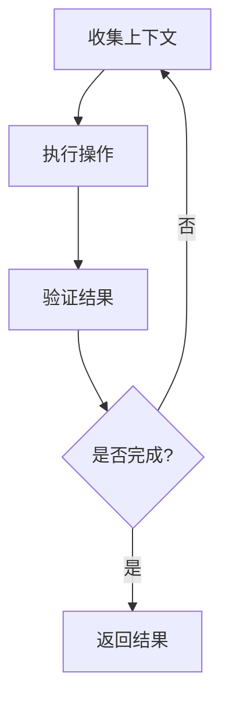

# Claude Agent SDK 深度研究报告

## 目录
1. [概述](#概述)
2. [核心架构](#核心架构)
3. [安装与配置](#安装与配置)
4. [TypeScript SDK 完整 API](#typescript-sdk-完整-api)
5. [Python SDK 完整 API](#python-sdk-完整-api)
6. [MCP (Model Context Protocol) 集成](#mcp-model-context-protocol-集成)
7. [自定义工具开发](#自定义工具开发)
8. [小红书服务 MCP 集成方案](#小红书服务-mcp-集成方案)
9. [实战代码示例](#实战代码示例)
10. [最佳实践](#最佳实践)

---

## 概述

### 什么是 Claude Agent SDK?

Claude Agent SDK (原名 Claude Code SDK) 是 Anthropic 官方发布的开源工具包,用于构建基于 Claude 的自主 AI 代理。该 SDK 提供了与 Claude Code CLI 工具相同的核心能力,允许开发者以编程方式构建能够理解代码库、编辑文件、执行命令和处理复杂工作流的自主代理。

### 发布时间线
- **2025年10月**: 与 Claude Sonnet 4.5 一同发布
- **核心特性**: 从编码工具演进为通用 AI 代理平台
- **开源协议**: MIT License

### 主要优势

1. **上下文管理** - 自动上下文压缩,优化大规模代码库处理
2. **丰富的工具生态** - 文件操作、代码执行、Web 搜索、MCP 扩展
3. **高级权限控制** - 细粒度权限管理
4. **生产就绪** - 内置错误处理、会话管理和监控

---

## 核心架构

### Agent 工作循环



### 核心组件

```typescript
┌─────────────────────────────────────────┐
│         Claude Agent SDK                │
├─────────────────────────────────────────┤
│                                         │
│  ┌──────────────┐  ┌─────────────────┐ │
│  │   Query API  │  │  Client API     │ │
│  │   (Simple)   │  │  (Advanced)     │ │
│  └──────────────┘  └─────────────────┘ │
│                                         │
│  ┌──────────────────────────────────┐  │
│  │      Tool System                 │  │
│  │  - Built-in Tools                │  │
│  │  - Custom Tools (SDK)            │  │
│  │  - External MCP Servers          │  │
│  └──────────────────────────────────┘  │
│                                         │
│  ┌──────────────────────────────────┐  │
│  │   Context Management             │  │
│  │  - Auto Compaction               │  │
│  │  - Memory Management             │  │
│  └──────────────────────────────────┘  │
│                                         │
│  ┌──────────────────────────────────┐  │
│  │   Permission System              │  │
│  │  - File Access Control           │  │
│  │  - Tool Permissions              │  │
│  └──────────────────────────────────┘  │
│                                         │
└─────────────────────────────────────────┘
```

---

## 安装与配置

### TypeScript/Node.js

#### 系统要求
- Node.js 18+
- TypeScript (推荐)

#### 安装

```bash
# 安装 SDK
npm install @anthropic-ai/claude-agent-sdk

# 可选: 安装 MCP SDK (如果需要创建 MCP 服务器)
npm install @modelcontextprotocol/sdk zod
```

#### 环境配置

```bash
# .env 文件
ANTHROPIC_API_KEY=sk-ant-api03-xxx
```

### Python

#### 系统要求
- Python 3.10+
- Node.js (某些功能需要)

#### 安装

```bash
# 安装 SDK
pip install claude-agent-sdk

# 可选: 安装 Claude Code CLI
npm install -g @anthropic-ai/claude-code
```

---

## TypeScript SDK 完整 API

### 1. Query API (简单模式)

#### 基本用法

```typescript
import { query } from '@anthropic-ai/claude-agent-sdk';

// 最简单的查询
for await (const message of query({
  prompt: "What is 2 + 2?"
})) {
  console.log(message);
}
```

#### 完整配置

```typescript
import { query, Options } from '@anthropic-ai/claude-agent-sdk';

const options: Options = {
  // 模型配置
  model: 'claude-sonnet-4-5-20250929',

  // 系统提示词
  systemPrompt: 'You are a helpful coding assistant',

  // 权限模式
  permissionMode: 'auto', // 'auto' | 'ask' | 'deny'

  // 工作目录
  workingDirectory: '/path/to/project',

  // 允许的工具
  allowedTools: [
    'Read',
    'Write',
    'Bash',
    'mcp__myserver__mytool'
  ],

  // 允许的目录 (文件访问控制)
  allowedDirectories: [
    '/path/to/allowed/dir'
  ],

  // 环境变量
  env: {
    CUSTOM_VAR: 'value'
  },

  // 最大轮次
  maxTurns: 50,

  // MCP 服务器配置
  mcpServers: {
    'myserver': {
      command: 'npx',
      args: ['-y', '@myorg/my-mcp-server'],
      env: {
        SERVER_API_KEY: 'xxx'
      }
    }
  },

  // 钩子函数
  hooks: {
    onSessionStart: async (sessionId) => {
      console.log('Session started:', sessionId);
    },

    onToolUse: async (tool, args) => {
      console.log('Tool used:', tool, args);
      return { allow: true };
    },

    onSessionEnd: async (sessionId) => {
      console.log('Session ended:', sessionId);
    }
  }
};

// 使用配置
for await (const message of query({
  prompt: "Analyze this codebase",
  options
})) {
  if (message.type === 'text') {
    console.log(message.text);
  } else if (message.type === 'tool_use') {
    console.log('Using tool:', message.tool, message.input);
  }
}
```

#### Query 对象方法

```typescript
const q = query({ prompt: "Hello" });

// 中断查询
await q.interrupt();

// 动态修改权限模式
await q.setPermissionMode('ask');

// 迭代消息
for await (const message of q) {
  console.log(message);
}
```

### 2. Client API (高级模式)

```typescript
import { ClaudeSDKClient } from '@anthropic-ai/claude-agent-sdk';

const client = new ClaudeSDKClient({
  apiKey: process.env.ANTHROPIC_API_KEY,
  model: 'claude-sonnet-4-5-20250929',
  systemPrompt: 'You are a helpful assistant'
});

// 多轮对话
const session = await client.createSession();

// 发送消息
const response1 = await session.sendMessage('Hello');
console.log(response1.text);

// 继续对话
const response2 = await session.sendMessage('Tell me more');
console.log(response2.text);

// 关闭会话
await session.close();
```

### 3. 自定义工具 API

#### 使用 `tool()` 函数

```typescript
import { tool, createSdkMcpServer } from '@anthropic-ai/claude-agent-sdk';
import { z } from 'zod';

// 定义工具
const weatherTool = tool(
  'get_weather',
  'Get current weather for a city',
  {
    city: z.string().describe('City name'),
    units: z.enum(['celsius', 'fahrenheit']).optional()
  },
  async (args, extra) => {
    const { city, units = 'celsius' } = args;

    // 调用天气 API
    const weather = await fetchWeather(city, units);

    return {
      content: [{
        type: 'text',
        text: JSON.stringify(weather, null, 2)
      }]
    };
  }
);

// 创建 SDK MCP 服务器
const weatherServer = createSdkMcpServer({
  name: 'weather-tools',
  version: '1.0.0',
  tools: [weatherTool]
});

// 在查询中使用
const options = {
  mcpServers: {
    'weather': weatherServer
  },
  allowedTools: ['mcp__weather__get_weather']
};

for await (const msg of query({
  prompt: "What's the weather in Beijing?",
  options
})) {
  console.log(msg);
}
```

### 4. 类型定义

```typescript
// 消息类型
type SDKMessage =
  | TextMessage
  | ToolUseMessage
  | ToolResultMessage;

interface TextMessage {
  type: 'text';
  text: string;
}

interface ToolUseMessage {
  type: 'tool_use';
  tool: string;
  input: Record<string, any>;
  id: string;
}

interface ToolResultMessage {
  type: 'tool_result';
  tool_use_id: string;
  content: ContentBlock[];
  is_error?: boolean;
}

// 权限模式
type PermissionMode = 'auto' | 'ask' | 'deny';

// 工具结果
interface CallToolResult {
  content: ContentBlock[];
  isError?: boolean;
}

type ContentBlock =
  | { type: 'text'; text: string }
  | { type: 'image'; source: ImageSource };

// 钩子类型
interface Hooks {
  onSessionStart?: (sessionId: string) => Promise<void>;
  onSessionEnd?: (sessionId: string) => Promise<void>;
  onToolUse?: (tool: string, args: any) => Promise<{ allow: boolean }>;
  onMessage?: (message: SDKMessage) => Promise<void>;
}
```

---

## Python SDK 完整 API

### 1. Query API

#### 基本用法

```python
import anyio
from claude_agent_sdk import query

async def main():
    async for message in query(prompt="What is 2 + 2?"):
        print(message)

anyio.run(main)
```

#### 完整配置

```python
from claude_agent_sdk import query, ClaudeAgentOptions

options = ClaudeAgentOptions(
    model='claude-sonnet-4-5-20250929',
    system_prompt='You are a helpful assistant',
    permission_mode='auto',
    working_directory='/path/to/project',
    allowed_tools=['Read', 'Write', 'Bash'],
    allowed_directories=['/path/to/allowed'],
    max_turns=50,
    env={'CUSTOM_VAR': 'value'},
    mcp_servers={
        'myserver': {
            'command': 'npx',
            'args': ['-y', '@myorg/server'],
            'env': {'API_KEY': 'xxx'}
        }
    }
)

async for message in query(
    prompt="Analyze this code",
    options=options
):
    if hasattr(message, 'text'):
        print(message.text)
```

### 2. Client API

```python
from claude_agent_sdk import ClaudeSDKClient

async def main():
    client = ClaudeSDKClient(
        api_key='sk-ant-xxx',
        model='claude-sonnet-4-5-20250929'
    )

    session = await client.create_session()

    response1 = await session.send_message('Hello')
    print(response1.text)

    response2 = await session.send_message('Continue')
    print(response2.text)

    await session.close()
```

### 3. 自定义工具

```python
from claude_agent_sdk import tool, create_sdk_mcp_server
from pydantic import BaseModel

class WeatherArgs(BaseModel):
    city: str
    units: str = 'celsius'

@tool(
    name='get_weather',
    description='Get current weather',
    args_schema=WeatherArgs
)
async def get_weather(args: WeatherArgs, extra):
    weather = await fetch_weather(args.city, args.units)
    return {
        'content': [
            {'type': 'text', 'text': str(weather)}
        ]
    }

# 创建服务器
server = create_sdk_mcp_server(
    name='weather-tools',
    version='1.0.0',
    tools=[get_weather]
)

# 使用
options = ClaudeAgentOptions(
    mcp_servers={'weather': server},
    allowed_tools=['mcp__weather__get_weather']
)
```

---

## MCP (Model Context Protocol) 集成

### 什么是 MCP?

Model Context Protocol (MCP) 是 Anthropic 支持的开放标准,用于将外部工具、数据库和 API 连接到 AI 应用。MCP 服务器可以提供:

1. **Tools (工具)** - AI 可以调用的函数
2. **Resources (资源)** - AI 可以访问的数据
3. **Prompts (提示)** - 预定义的提示模板

### MCP 架构

```
┌─────────────────┐          ┌──────────────────┐
│  Claude Agent   │          │   MCP Server     │
│      SDK        │          │                  │
│                 │          │  ┌────────────┐  │
│  ┌───────────┐  │  stdio   │  │   Tools    │  │
│  │   Client  │◄─┼──────────┼─►│            │  │
│  └───────────┘  │  or HTTP │  ├────────────┤  │
│                 │          │  │ Resources  │  │
└─────────────────┘          │  ├────────────┤  │
                             │  │  Prompts   │  │
                             │  └────────────┘  │
                             └──────────────────┘
```

### 配置 MCP 服务器

#### 1. 通过 .mcp.json 配置文件

```json
{
  "mcpServers": {
    "filesystem": {
      "command": "npx",
      "args": ["-y", "@modelcontextprotocol/server-filesystem"],
      "env": {
        "ALLOWED_PATHS": "/Users/me/projects"
      }
    },
    "playwright": {
      "command": "npx",
      "args": ["-y", "@executeautomation/playwright-mcp-server"]
    },
    "custom-server": {
      "url": "http://localhost:3000/mcp",
      "transport": "sse"
    }
  }
}
```

#### 2. 通过代码配置

```typescript
import { query } from '@anthropic-ai/claude-agent-sdk';

const options = {
  mcpServers: {
    'filesystem': {
      command: 'npx',
      args: ['-y', '@modelcontextprotocol/server-filesystem'],
      env: {
        ALLOWED_PATHS: '/path/to/files'
      }
    }
  },
  allowedTools: [
    'mcp__filesystem__read_file',
    'mcp__filesystem__write_file'
  ]
};

for await (const msg of query({
  prompt: "Read package.json",
  options
})) {
  console.log(msg);
}
```

### MCP 传输方式

#### 1. Stdio (标准输入/输出)

```typescript
{
  command: 'node',
  args: ['./my-server.js'],
  transport: 'stdio' // 默认值
}
```

#### 2. HTTP/SSE (服务器推送事件)

```typescript
{
  url: 'http://localhost:3000/mcp',
  transport: 'sse'
}
```

#### 3. Streamable HTTP (推荐的新方式)

```typescript
{
  url: 'http://localhost:3000/mcp',
  transport: 'streamable-http'
}
```

---

## 自定义工具开发

### 方式 1: SDK 内置工具 (推荐用于简单工具)

适用场景:
- 在同一进程中运行
- 需要访问应用内部状态
- 性能敏感的操作

```typescript
import { tool, createSdkMcpServer } from '@anthropic-ai/claude-agent-sdk';
import { z } from 'zod';

// 定义工具
const databaseQueryTool = tool(
  'query_database',
  'Execute SQL query on the database',
  {
    query: z.string().describe('SQL query to execute'),
    params: z.array(z.any()).optional().describe('Query parameters')
  },
  async (args, extra) => {
    const { query, params = [] } = args;

    try {
      // 执行数据库查询
      const result = await db.query(query, params);

      return {
        content: [{
          type: 'text',
          text: JSON.stringify(result, null, 2)
        }]
      };
    } catch (error) {
      return {
        content: [{
          type: 'text',
          text: `Error: ${error.message}`
        }],
        isError: true
      };
    }
  }
);

// 创建服务器
const dbServer = createSdkMcpServer({
  name: 'database-tools',
  version: '1.0.0',
  tools: [databaseQueryTool]
});

// 使用
const options = {
  mcpServers: { 'db': dbServer },
  allowedTools: ['mcp__db__query_database']
};
```

### 方式 2: 独立 MCP 服务器 (推荐用于复杂工具)

适用场景:
- 独立服务
- 可以被多个客户端使用
- 需要隔离的环境
- 跨语言支持

#### 创建 MCP 服务器 (TypeScript)

```typescript
// my-mcp-server/index.ts
import { McpServer } from '@modelcontextprotocol/sdk/server/mcp.js';
import { StdioServerTransport } from '@modelcontextprotocol/sdk/server/stdio.js';
import { z } from 'zod';

// 创建服务器
const server = new McpServer({
  name: 'my-custom-server',
  version: '1.0.0'
});

// 注册工具
server.tool(
  'send_email',
  'Send an email',
  {
    to: z.string().email(),
    subject: z.string(),
    body: z.string()
  },
  async ({ to, subject, body }) => {
    // 发送邮件逻辑
    await sendEmail(to, subject, body);

    return {
      content: [{
        type: 'text',
        text: `Email sent to ${to}`
      }]
    };
  }
);

// 注册资源
server.resource(
  'user_profile',
  'Get user profile data',
  {
    userId: z.string()
  },
  async ({ userId }) => {
    const profile = await getUserProfile(userId);

    return {
      contents: [{
        uri: `user://${userId}`,
        mimeType: 'application/json',
        text: JSON.stringify(profile, null, 2)
      }]
    };
  }
);

// 启动服务器
async function main() {
  const transport = new StdioServerTransport();
  await server.connect(transport);
  console.error('MCP Server started');
}

main();
```

#### 项目结构

```
my-mcp-server/
├── package.json
├── tsconfig.json
├── src/
│   ├── index.ts
│   ├── tools/
│   │   ├── email.ts
│   │   └── database.ts
│   └── resources/
│       └── users.ts
└── dist/
    └── index.js
```

#### package.json

```json
{
  "name": "my-mcp-server",
  "version": "1.0.0",
  "type": "module",
  "bin": {
    "my-mcp-server": "./dist/index.js"
  },
  "scripts": {
    "build": "tsc",
    "start": "node dist/index.js"
  },
  "dependencies": {
    "@modelcontextprotocol/sdk": "latest",
    "zod": "^3.0.0"
  },
  "devDependencies": {
    "typescript": "^5.0.0"
  }
}
```

---

## 小红书服务 MCP 集成方案

### 方案概述

将现有的小红书 Playwright 服务封装为 MCP 服务器,使 Claude Agent 能够直接调用小红书自动化功能。

### 架构设计

```
┌──────────────────────────────────────────────────────────┐
│                 Claude Agent SDK                         │
└────────────────────┬─────────────────────────────────────┘
                     │
                     │ MCP Protocol (stdio)
                     │
┌────────────────────▼─────────────────────────────────────┐
│           Xiaohongshu MCP Server                         │
│  ┌────────────────────────────────────────────────────┐  │
│  │  Tools:                                            │  │
│  │  - xiaohongshu_login                               │  │
│  │  - xiaohongshu_preview_post                        │  │
│  │  - xiaohongshu_publish_post                        │  │
│  │  - xiaohongshu_check_task_status                   │  │
│  │  - xiaohongshu_get_login_qr                        │  │
│  └────────────────────────────────────────────────────┘  │
└────────────────────┬─────────────────────────────────────┘
                     │
                     │ HTTP API
                     │
┌────────────────────▼─────────────────────────────────────┐
│        Existing Playwright Service (Express)             │
│  - Browser Pool Management                               │
│  - BullMQ Queue                                          │
│  - Playwright Automation                                 │
└──────────────────────────────────────────────────────────┘
```

### 实现方案

#### 方案 1: 独立 MCP 服务器 (推荐)

**优点:**
- 与现有服务解耦
- 可以独立部署和维护
- 更好的错误隔离
- 支持多个 Claude 客户端

**文件结构:**

```
playwright-service/
├── src/                     # 现有服务
│   ├── server.js
│   ├── xiaohongshu.js
│   └── ...
├── mcp-server/              # 新增 MCP 服务器
│   ├── package.json
│   ├── tsconfig.json
│   ├── src/
│   │   ├── index.ts         # MCP 服务器入口
│   │   ├── tools/
│   │   │   ├── login.ts
│   │   │   ├── publish.ts
│   │   │   └── status.ts
│   │   └── client.ts        # HTTP 客户端
│   └── dist/
└── .mcp.json                # MCP 配置
```

#### 方案 2: 内嵌 MCP 端点

**优点:**
- 不需要额外进程
- 共享应用状态
- 更简单的部署

**缺点:**
- 耦合度高
- 只能通过 HTTP/SSE 访问

### 详细实现

见下一节 "实战代码示例"

---

## 实战代码示例

### 示例 1: 小红书 MCP 服务器完整实现

#### 1. 项目初始化

```bash
cd /path/to/playwright-service
mkdir mcp-server
cd mcp-server

npm init -y
npm install @modelcontextprotocol/sdk zod axios
npm install -D typescript @types/node

npx tsc --init
```

#### 2. MCP 服务器代码

**mcp-server/src/index.ts**

```typescript
#!/usr/bin/env node
import { McpServer } from '@modelcontextprotocol/sdk/server/mcp.js';
import { StdioServerTransport } from '@modelcontextprotocol/sdk/server/stdio.js';
import { z } from 'zod';
import axios from 'axios';

// Playwright 服务的 API 地址
const PLAYWRIGHT_SERVICE_URL = process.env.PLAYWRIGHT_SERVICE_URL || 'http://localhost:3001';

// HTTP 客户端
const apiClient = axios.create({
  baseURL: PLAYWRIGHT_SERVICE_URL,
  timeout: 60000
});

// 创建 MCP 服务器
const server = new McpServer({
  name: 'xiaohongshu-mcp',
  version: '1.0.0'
});

// ==================== 工具 1: 获取登录二维码 ====================
server.tool(
  'xiaohongshu_get_login_qr',
  'Get Xiaohongshu login QR code for a user',
  {
    userId: z.string().describe('User ID for login session')
  },
  async ({ userId }) => {
    try {
      const response = await apiClient.post('/api/login/qrcode', { userId });

      return {
        content: [{
          type: 'text',
          text: JSON.stringify({
            success: true,
            qrcode: response.data.qrcode,
            message: 'QR code generated. Please scan with Xiaohongshu app.'
          }, null, 2)
        }]
      };
    } catch (error: any) {
      return {
        content: [{
          type: 'text',
          text: `Error: ${error.message}`
        }],
        isError: true
      };
    }
  }
);

// ==================== 工具 2: 检查登录状态 ====================
server.tool(
  'xiaohongshu_check_login',
  'Check if user has completed login by scanning QR code',
  {
    userId: z.string().describe('User ID')
  },
  async ({ userId }) => {
    try {
      const response = await apiClient.get('/api/login/status', {
        params: { userId }
      });

      return {
        content: [{
          type: 'text',
          text: JSON.stringify({
            success: true,
            status: response.data.status,
            isLoggedIn: response.data.status === 'logged_in'
          }, null, 2)
        }]
      };
    } catch (error: any) {
      return {
        content: [{
          type: 'text',
          text: `Error: ${error.message}`
        }],
        isError: true
      };
    }
  }
);

// ==================== 工具 3: 预览发布 ====================
server.tool(
  'xiaohongshu_preview_post',
  'Preview Xiaohongshu post before publishing',
  {
    userId: z.string().describe('User ID'),
    title: z.string().describe('Post title'),
    content: z.string().describe('Post content'),
    images: z.array(z.string()).optional().describe('Array of image file paths'),
    tags: z.array(z.string()).optional().describe('Array of tags')
  },
  async ({ userId, title, content, images, tags }) => {
    try {
      const response = await apiClient.post('/api/publish', {
        userId,
        mode: 'preview',
        title,
        content,
        images: images || [],
        tags: tags || []
      });

      const { taskId } = response.data;

      // 轮询任务状态
      const result = await pollTaskStatus(taskId, 120000); // 2分钟超时

      return {
        content: [{
          type: 'text',
          text: JSON.stringify({
            success: true,
            taskId,
            screenshot: result.screenshot,
            message: 'Preview generated successfully'
          }, null, 2)
        }]
      };
    } catch (error: any) {
      return {
        content: [{
          type: 'text',
          text: `Error: ${error.message}`
        }],
        isError: true
      };
    }
  }
);

// ==================== 工具 4: 发布内容 ====================
server.tool(
  'xiaohongshu_publish_post',
  'Publish post to Xiaohongshu',
  {
    userId: z.string().describe('User ID'),
    title: z.string().describe('Post title'),
    content: z.string().describe('Post content'),
    images: z.array(z.string()).optional().describe('Array of image file paths'),
    tags: z.array(z.string()).optional().describe('Array of tags')
  },
  async ({ userId, title, content, images, tags }) => {
    try {
      const response = await apiClient.post('/api/publish', {
        userId,
        mode: 'publish',
        title,
        content,
        images: images || [],
        tags: tags || []
      });

      const { taskId } = response.data;

      // 轮询任务状态
      const result = await pollTaskStatus(taskId, 180000); // 3分钟超时

      return {
        content: [{
          type: 'text',
          text: JSON.stringify({
            success: true,
            taskId,
            message: 'Post published successfully'
          }, null, 2)
        }]
      };
    } catch (error: any) {
      return {
        content: [{
          type: 'text',
          text: `Error: ${error.message}`
        }],
        isError: true
      };
    }
  }
);

// ==================== 工具 5: 查询任务状态 ====================
server.tool(
  'xiaohongshu_task_status',
  'Check the status of a Xiaohongshu task',
  {
    taskId: z.string().describe('Task ID')
  },
  async ({ taskId }) => {
    try {
      const response = await apiClient.get(`/api/task/${taskId}`);

      return {
        content: [{
          type: 'text',
          text: JSON.stringify(response.data, null, 2)
        }]
      };
    } catch (error: any) {
      return {
        content: [{
          type: 'text',
          text: `Error: ${error.message}`
        }],
        isError: true
      };
    }
  }
);

// ==================== 辅助函数 ====================

/**
 * 轮询任务状态直到完成或超时
 */
async function pollTaskStatus(taskId: string, timeout: number = 120000): Promise<any> {
  const startTime = Date.now();
  const pollInterval = 2000; // 2秒

  while (Date.now() - startTime < timeout) {
    const response = await apiClient.get(`/api/task/${taskId}`);
    const status = response.data;

    if (status.status === 'completed') {
      return status.result;
    } else if (status.status === 'failed') {
      throw new Error(`Task failed: ${status.error}`);
    }

    // 等待后继续轮询
    await new Promise(resolve => setTimeout(resolve, pollInterval));
  }

  throw new Error('Task timeout');
}

// ==================== 启动服务器 ====================

async function main() {
  const transport = new StdioServerTransport();
  await server.connect(transport);

  console.error('Xiaohongshu MCP Server started');
  console.error('Service URL:', PLAYWRIGHT_SERVICE_URL);
}

main().catch((error) => {
  console.error('Failed to start server:', error);
  process.exit(1);
});
```

#### 3. package.json

```json
{
  "name": "xiaohongshu-mcp-server",
  "version": "1.0.0",
  "type": "module",
  "description": "MCP server for Xiaohongshu automation",
  "main": "dist/index.js",
  "bin": {
    "xiaohongshu-mcp": "./dist/index.js"
  },
  "scripts": {
    "build": "tsc",
    "start": "node dist/index.js",
    "dev": "tsc && node dist/index.js"
  },
  "dependencies": {
    "@modelcontextprotocol/sdk": "latest",
    "axios": "^1.6.0",
    "zod": "^3.22.0"
  },
  "devDependencies": {
    "@types/node": "^20.0.0",
    "typescript": "^5.3.0"
  }
}
```

#### 4. tsconfig.json

```json
{
  "compilerOptions": {
    "target": "ES2022",
    "module": "ES2022",
    "moduleResolution": "node",
    "outDir": "./dist",
    "rootDir": "./src",
    "strict": true,
    "esModuleInterop": true,
    "skipLibCheck": true,
    "forceConsistentCasingInFileNames": true
  },
  "include": ["src/**/*"],
  "exclude": ["node_modules"]
}
```

#### 5. 配置文件

**.mcp.json** (放在项目根目录)

```json
{
  "mcpServers": {
    "xiaohongshu": {
      "command": "node",
      "args": ["./mcp-server/dist/index.js"],
      "env": {
        "PLAYWRIGHT_SERVICE_URL": "http://localhost:3001"
      }
    }
  }
}
```

#### 6. 使用 MCP 服务器

**方式 1: Claude Code CLI**

```bash
# 启动 Playwright 服务
npm run dev

# 在另一个终端,使用 Claude Code
claude

# 在 Claude Code 中:
"请帮我登录小红书,userId 是 'user123'"
"预览一篇标题为'测试'的小红书文章"
```

**方式 2: Claude Agent SDK**

```typescript
import { query } from '@anthropic-ai/claude-agent-sdk';

const options = {
  mcpServers: {
    'xiaohongshu': {
      command: 'node',
      args: ['./mcp-server/dist/index.js'],
      env: {
        PLAYWRIGHT_SERVICE_URL: 'http://localhost:3001'
      }
    }
  },
  allowedTools: [
    'mcp__xiaohongshu__xiaohongshu_get_login_qr',
    'mcp__xiaohongshu__xiaohongshu_check_login',
    'mcp__xiaohongshu__xiaohongshu_preview_post',
    'mcp__xiaohongshu__xiaohongshu_publish_post'
  ]
};

for await (const msg of query({
  prompt: `
    帮我发布一篇小红书文章:
    - userId: user123
    - 标题: AI 自动化工具分享
    - 内容: 介绍 Claude Agent SDK...
    - 标签: AI, 自动化, 工具

    先预览,确认无误后再发布。
  `,
  options
})) {
  console.log(msg);
}
```

### 示例 2: 在现有 Express 服务中添加 MCP 端点

如果不想创建独立的 MCP 服务器,也可以在现有 Express 服务中添加 MCP HTTP 端点:

```typescript
// src/mcp-endpoint.ts
import { McpServer } from '@modelcontextprotocol/sdk/server/mcp.js';
import { StreamableHTTPServerTransport } from '@modelcontextprotocol/sdk/server/streamable-http.js';
import express from 'express';

export function setupMcpEndpoint(app: express.Application) {
  const server = new McpServer({
    name: 'xiaohongshu-mcp',
    version: '1.0.0'
  });

  // 注册工具... (同上)

  // 创建 HTTP 端点
  app.post('/mcp', async (req, res) => {
    const transport = new StreamableHTTPServerTransport(req, res);
    await server.connect(transport);
  });
}

// src/server.js
import { setupMcpEndpoint } from './mcp-endpoint';

// ... 现有代码 ...

setupMcpEndpoint(app);
```

---

## 最佳实践

### 1. 工具设计原则

#### ✅ 好的工具设计

```typescript
// 单一职责,参数清晰
server.tool(
  'send_email',
  'Send an email to a recipient',
  {
    to: z.string().email().describe('Recipient email address'),
    subject: z.string().describe('Email subject'),
    body: z.string().describe('Email body content'),
    attachments: z.array(z.string()).optional().describe('File paths')
  },
  async (args) => { /* ... */ }
);
```

#### ❌ 避免的设计

```typescript
// 职责过于复杂,参数不清晰
server.tool(
  'do_everything',
  'Handle all email operations',
  {
    action: z.string(), // 太模糊
    data: z.any() // 不明确
  },
  async (args) => { /* ... */ }
);
```

### 2. 错误处理

```typescript
server.tool('my_tool', 'description', schema, async (args) => {
  try {
    const result = await riskyOperation(args);

    return {
      content: [{
        type: 'text',
        text: JSON.stringify(result, null, 2)
      }]
    };
  } catch (error: any) {
    // 返回错误信息,而不是抛出异常
    return {
      content: [{
        type: 'text',
        text: `Error: ${error.message}\nStack: ${error.stack}`
      }],
      isError: true
    };
  }
});
```

### 3. 进度反馈

对于长时间运行的任务,提供进度反馈:

```typescript
server.tool('long_task', 'description', schema, async (args) => {
  const taskId = await startTask(args);

  // 返回任务 ID,让用户后续查询
  return {
    content: [{
      type: 'text',
      text: JSON.stringify({
        taskId,
        message: 'Task started. Use check_task_status to monitor progress.'
      }, null, 2)
    }]
  };
});

server.tool('check_task_status', 'Check task status', {
  taskId: z.string()
}, async ({ taskId }) => {
  const status = await getTaskStatus(taskId);

  return {
    content: [{
      type: 'text',
      text: JSON.stringify({
        taskId,
        status: status.state,
        progress: status.progress,
        result: status.result
      }, null, 2)
    }]
  };
});
```

### 4. 权限和安全

```typescript
const options = {
  // 只允许必要的工具
  allowedTools: [
    'Read',
    'mcp__xiaohongshu__xiaohongshu_publish_post'
  ],

  // 限制文件访问
  allowedDirectories: [
    '/path/to/safe/directory'
  ],

  // 使用 'ask' 模式让用户确认敏感操作
  permissionMode: 'ask',

  // 钩子中实现自定义权限检查
  hooks: {
    onToolUse: async (tool, args) => {
      // 实现自定义逻辑
      if (tool === 'mcp__xiaohongshu__xiaohongshu_publish_post') {
        // 检查用户权限
        const hasPermission = await checkUserPermission(args.userId);
        return { allow: hasPermission };
      }
      return { allow: true };
    }
  }
};
```

### 5. 测试策略

```typescript
// test/mcp-server.test.ts
import { McpServer } from '@modelcontextprotocol/sdk/server/mcp.js';

describe('Xiaohongshu MCP Server', () => {
  let server: McpServer;

  beforeEach(() => {
    server = new McpServer({ name: 'test', version: '1.0.0' });
    // 注册工具...
  });

  it('should publish post successfully', async () => {
    const result = await server.callTool('xiaohongshu_publish_post', {
      userId: 'test-user',
      title: 'Test',
      content: 'Test content'
    });

    expect(result.isError).toBe(false);
    expect(result.content[0].text).toContain('success');
  });

  it('should handle errors gracefully', async () => {
    const result = await server.callTool('xiaohongshu_publish_post', {
      userId: 'invalid'
    });

    expect(result.isError).toBe(true);
  });
});
```

### 6. 监控和日志

```typescript
import winston from 'winston';

const logger = winston.createLogger({
  level: 'info',
  format: winston.format.json(),
  transports: [
    new winston.transports.File({ filename: 'mcp-server.log' })
  ]
});

server.tool('my_tool', 'description', schema, async (args) => {
  logger.info('Tool called', { tool: 'my_tool', args });

  try {
    const result = await operation(args);
    logger.info('Tool succeeded', { tool: 'my_tool', result });
    return formatSuccess(result);
  } catch (error) {
    logger.error('Tool failed', { tool: 'my_tool', error });
    return formatError(error);
  }
});
```

### 7. 文档和注释

```typescript
/**
 * 小红书发布工具
 *
 * 功能:
 * - 支持图文发布
 * - 支持标签和话题
 * - 自动处理图片上传
 *
 * 限制:
 * - 最多 9 张图片
 * - 标题最长 20 字
 * - 内容最长 1000 字
 *
 * @param userId - 用户 ID (必须已登录)
 * @param title - 标题 (1-20 字符)
 * @param content - 内容 (1-1000 字符)
 * @param images - 图片路径数组 (最多 9 张)
 * @param tags - 标签数组 (可选)
 */
server.tool(
  'xiaohongshu_publish_post',
  'Publish a post to Xiaohongshu with images and tags',
  {
    userId: z.string().describe('User ID (must be logged in)'),
    title: z.string().min(1).max(20).describe('Post title (1-20 characters)'),
    content: z.string().min(1).max(1000).describe('Post content (1-1000 characters)'),
    images: z.array(z.string()).max(9).optional().describe('Image file paths (max 9)'),
    tags: z.array(z.string()).optional().describe('Tags for the post')
  },
  async (args) => { /* ... */ }
);
```

---

## 总结

### Claude Agent SDK 核心价值

1. **统一的代理框架** - 提供标准化的方式构建 AI 代理
2. **强大的工具生态** - 通过 MCP 轻松集成外部服务
3. **生产就绪** - 内置权限控制、错误处理、监控
4. **灵活性** - 支持多种部署方式和集成模式

### 小红书 MCP 集成收益

1. **自然语言控制** - 用自然语言操作小红书发布
2. **智能化工作流** - AI 可以自主完成复杂的发布流程
3. **可扩展性** - 轻松添加更多小红书功能
4. **可重用性** - MCP 服务器可以被多个客户端使用

### 下一步行动

1. **快速原型** - 使用提供的代码创建 MCP 服务器
2. **测试验证** - 在本地环境测试所有功能
3. **功能扩展** - 根据需求添加更多工具
4. **生产部署** - 部署到生产环境并监控

---

## 附录

### 相关资源

- **官方文档**: https://docs.claude.com/en/api/agent-sdk/overview
- **TypeScript SDK**: https://github.com/anthropics/claude-agent-sdk-typescript
- **Python SDK**: https://github.com/anthropics/claude-agent-sdk-python
- **MCP 协议**: https://modelcontextprotocol.io
- **MCP TypeScript SDK**: https://github.com/modelcontextprotocol/typescript-sdk
- **示例服务器**: https://github.com/modelcontextprotocol/servers
- **Playwright MCP**: https://github.com/executeautomation/mcp-playwright

### 社区支持

- **Discord**: https://anthropic.com/discord
- **GitHub Issues**:
  - TypeScript: https://github.com/anthropics/claude-agent-sdk-typescript/issues
  - Python: https://github.com/anthropics/claude-agent-sdk-python/issues

---

**文档版本**: 1.0.0
**最后更新**: 2025-10-04
**作者**: Claude Agent SDK 研究团队
